# Hackings style defence tricks
Simple technical techniques that allow you to detect intruders at different stages.
All the techniques presented do not require exclusive rights and can be performed by an ordinary employee - everyone can protect their company.

## Network level \[internal intruder\]
The attacker has just penetrated your corporate network. He doesn't have an account yet and knows almost nothing about your network. His actions will be largely random. It is very important to catch the attacker at this early stage.

### sniffer.py
A running sniffer is not yet a network attack, but its detection is an important prerequisite for possible future attacks. A decent user will not run the sniffer.
A carelessly launched sniffer will make DNS requests that are predictable for us, since the sniffer can show a domain name instead of an IP address. If we periodically send a packet on behalf of an IP address that has a PTR DNS record, and then check the presence of this record in the cache of the corporate DNS server (non-recursive request, aka DNS cache snooping), then we will most likely detect an attacker.

<table border="0">
 <tr>
    <td>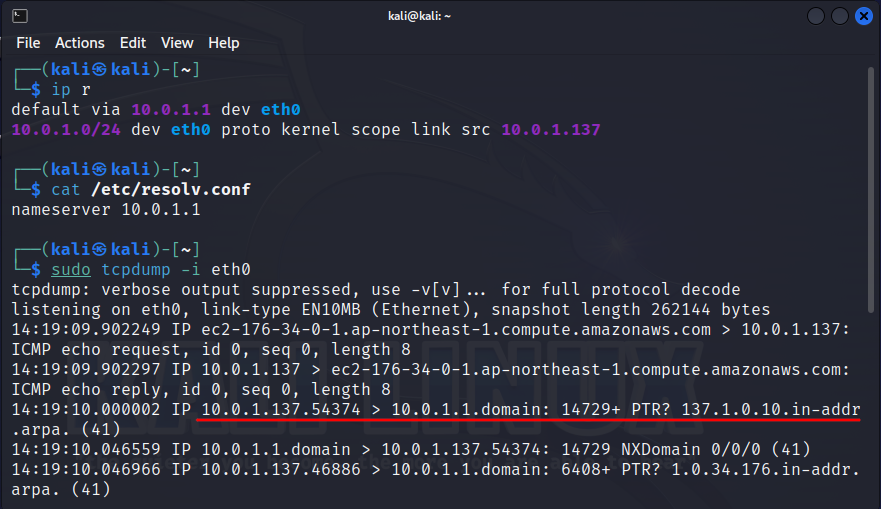</td>
    <td>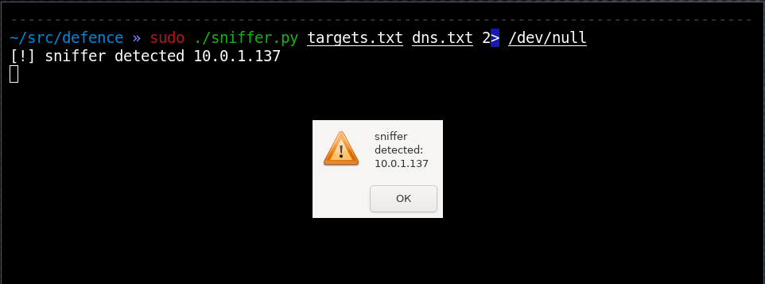</td>
 </tr>
</table>

### tcp.py
The second thing that an internal attacker will most likely use at the very beginning is, of course, port scanning. While he does not have an account and does not understand the structure of the network, he will blindly search for his targets by scanning ports. And sooner or later its packets will reach your computer.
It is quite easy to notice such activity. Of all the traffic, only TCP-SYN packets need to be isolated, which is an excellent marker for this network attack. The `tcp.py` script reacts only to incoming connections; if the number of unique ports is exceeded, an alert occurs.
As a result, even if the attacker scanned only a couple of ports, we will see it.

<table border="0">
 <tr>
    <td>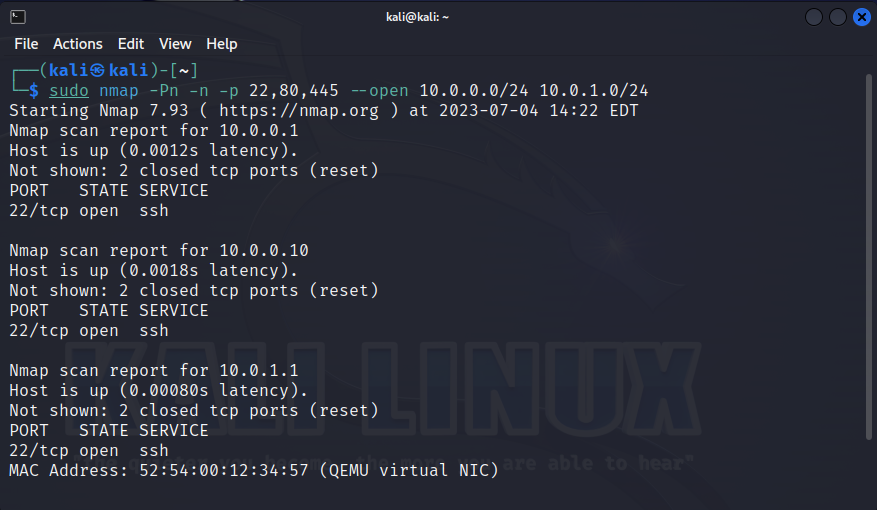</td>
    <td>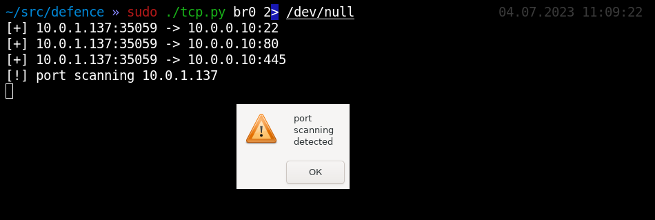</td>
 </tr>
</table>

### mitm.py

Having listened to enough traffic and scanned his targets, the attacker can finally move on to active action and begin intercepting traffic. It doesn’t matter how he does it, what matters is where it all leads. If an attacker begins to pass others traffic through himself, this will lead to a decrease in IP.ttl in it
This script periodically pings each node in the list. And as soon as the route length (IP.ttl) changes somewhere, it produces a trace instantly calculating the impudent one.
The first thing you need to monitor in this way is, of course, your gateway. However, this detection method allows you to see the consequences of traffic interception outside your own subnet - throughout the entire local network, because it is far from a fact that the attacker will be on the same subnet as you. So the monitoring list can be expanded to include critical servers - your DC, Exchange, SCCM, WSUS, virtualization, etc. Moreover, you can monitor the gateway of each VLAN and even each workstation.

<table border="0">
 <tr>
    <td>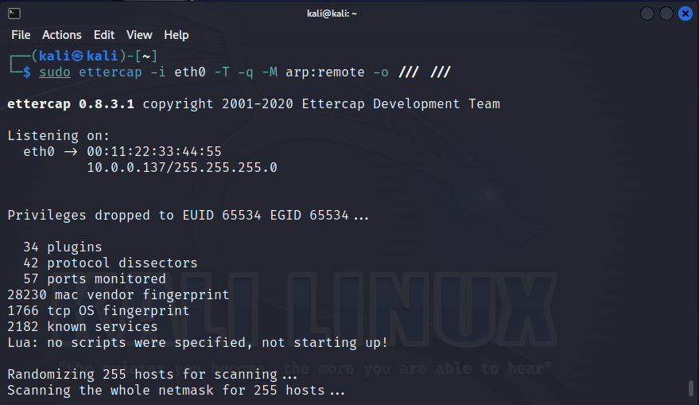</td>
    <td>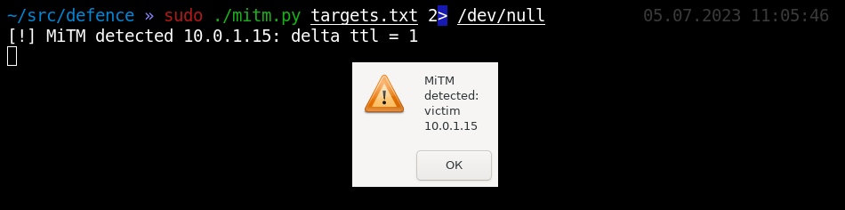</td>
 </tr>
</table>

Under some circumstances, an attacker may stand not in the middle, but instead of some network device.
Therefore, it is more effective to check traffic interception not through the length of the route, but through the route itself - using tracerouting. This method will also allow you to see particularly cunning attackers who made a TTL fixation before intercepting traffic.
However, the tracing procedure is somewhat longer, and therefore this default detection method is commented out in the script.

### dhcp.py

In local networks, in addition to full-fledged MiTM attacks, “partial” traffic interception attacks can also be carried out. One example would be DHCP allowing you to specify yourself as a gateway or DNS server. By controlling DNS requests, an attacker can selectively redirect connections, thereby implementing partial MiTM.
If IPv6 is not used on the local network, but it is not disabled on network nodes, then an attacker can achieve a similar effect using DHCPv6, since all modern operating systems prefer IPv6 over IPv4.
Both attacks can be detected with single Discover requests. The script periodically sends such broadcast requests to DHCP and DHCPv6. And if someone else besides the legitimate node begins to respond, detection occurs.
Application - only the current network segment.

<table border="0">
 <tr>
    <td>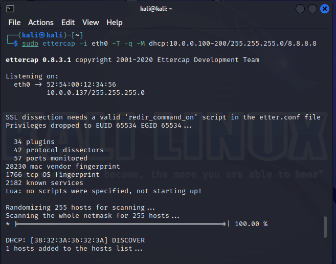</td>
    <td>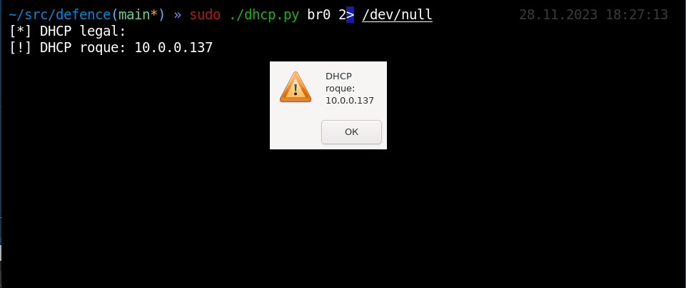</td>
 </tr>
</table>

<table border="0">
 <tr>
    <td>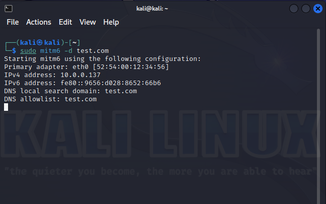</td>
    <td>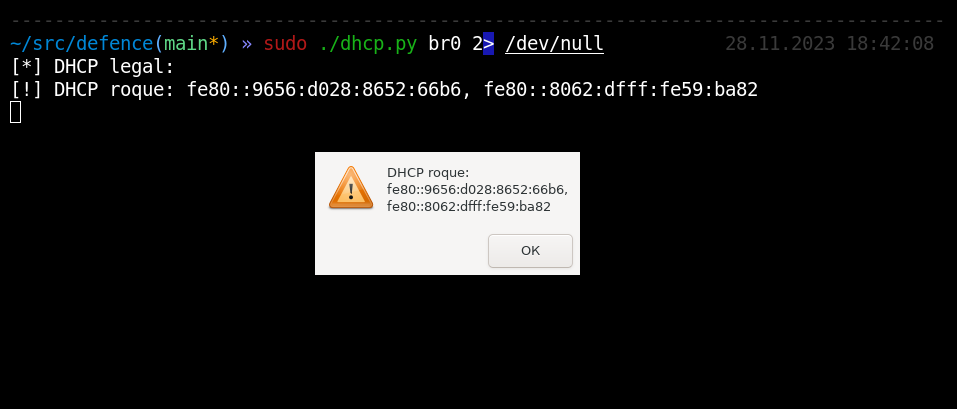</td>
 </tr>
</table>

### netbios.py

In local networks, a much more popular example of partial traffic interception is <ins>responder</ins>. By responding with false responses to name resolution broadcasts (for example through NetBIOS), a hacker can trick your workstation into connecting anywhere, even to himself. As a result, this leads to erroneous connections, with usually automatic end-to-end authentication. In turn, this exposes credentials that can be subject to bruteforce attacks, or can be used to bypass authentication using NTLM relay attacks.
Detecting a responder is easy. You just need to generate a random short name and ask about it broadcast. Script `netbios.py` makes this check. It periodically broadcasts NetBIOS requests with random names to the network. And as soon as the answers begin to arrive - alert.
Application - only the current network segment.

<table border="0">
 <tr>
    <td>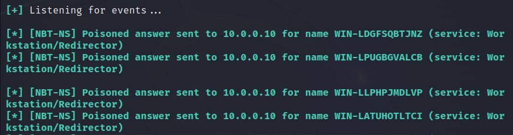</td>
    <td>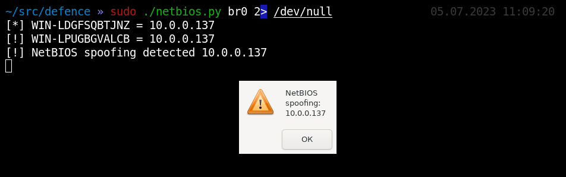</td>
 </tr>
</table>

### honeypot/smb/ms17-010.sh

Once on the internal network, advanced attackers look for so-called “low-hanging fruit” - vulnerabilities that are frequently encountered, easily exploited and have the highest impact. And perhaps the champion here is MS17-010. Checkers for this vulnerability are everywhere: in scanners like `nessus`, exploit packs like `metasploit`, and of course everyone’s favorite `nmap`.
In all cases, the vulnerability check occurs in a similar way - calling the SMB transaction TRANS_PEEK_NMPIPE (0x23) with the parameter MaxParameterCount = 0xffff, the response to which should be STATUS_INSUFF_SERVER_RESOURCES (0xC0000205).
To pretend that we are vulnerable to MS17-010, we can use the hacker tool `smbserver.py` as a basis. As a result, our computer will look vulnerable to all checkers.

<table border="0">
 <tr>
    <td>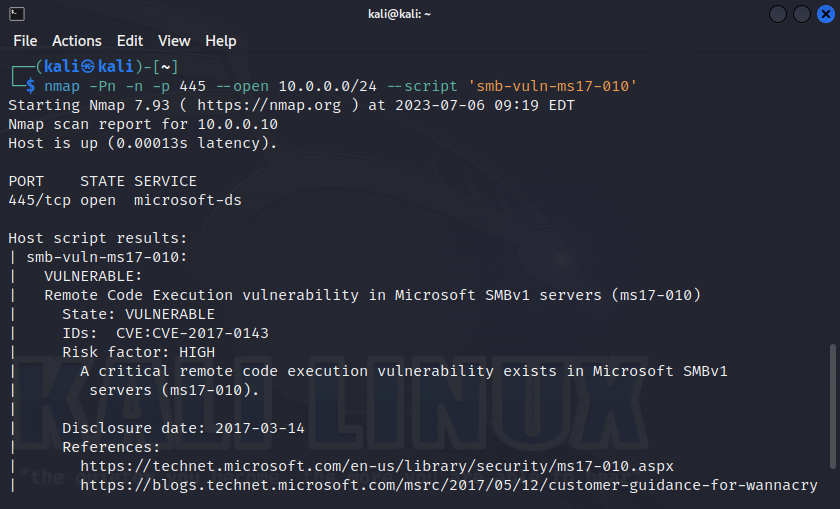</td>
    <td>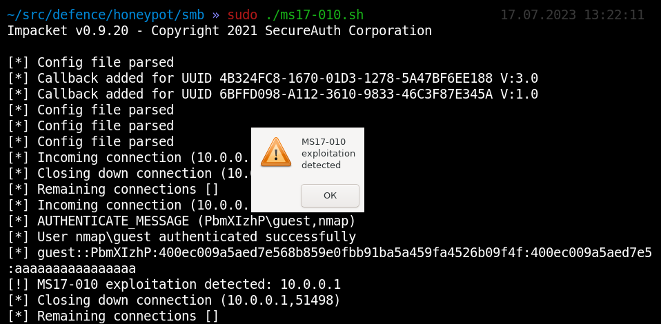</td>
 </tr>
</table>

Just imagine the joy of a hacker who discovered a vulnerable machine - and you set him on the wrong trail and caught him in a trap.
Such a trap `ms17-010.sh` will be more noticeable in networks with a high level of security, because even one single MS17-010 for an attacker will be like a fire in the middle of a field at night.

### honeypot/ssh/auth.py

On a local network, Linux servers can also be attacked. The most common, simple and effective attack against them is ssh password guessing. Unlike all other potentially vulnerable services, openssh is present on almost every server. Such low-hanging fruit can follow both in the very first steps after hacking - immediately after port scanning, and later - during a password spraying attack.
All you need to notice an attacker is just run an SSH server somewhere that shows authentication attempts.
Based on the results of port scanning, it will certainly be included in the list of brute force targets and will immediately notice this attack.

<table border="0">
 <tr>
    <td>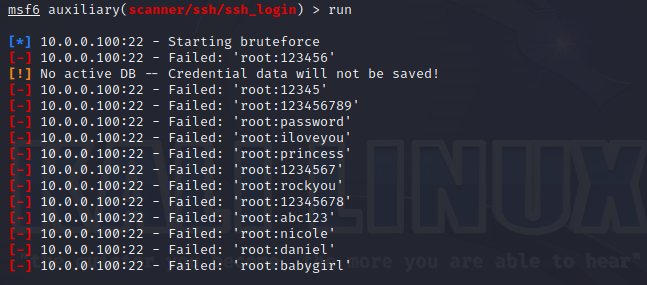</td>
    <td>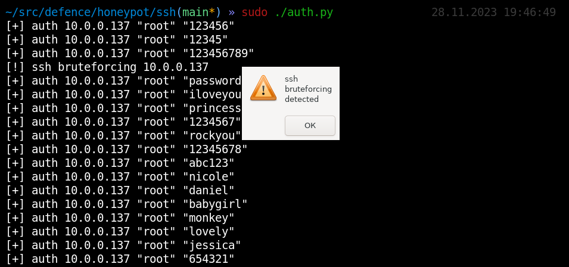</td>
 </tr>
</table>

And from the passwords we select, we can quickly understand that one or another dictionary was used.

## Active Directory level \[internal intruder\]

If the attacker moved undetected to the Active Directory level, then we lost the first round. Now he faces a dozen other actual privilege escalation attacks, some of which are quite silent. But we still have a chance to see some characteristic features, it’s just important to know what to look for.
There are a couple of tricks that allow you to see attacks in the Active Directory environment, and any domain user can do them.

### ad/auth.py

Absolutely any domain user can request via LDAP a list of objects whose special attributes - timestamps - have changed. By tracking changes in the `lastLogon` attribute, you can see the dynamics of successful authentications, the `badPasswordTime` attribute - false authentications, and `lockoutTime` - the dynamics of locks. And all this means that any domain user is able to see the activity of all users and, therefore, see password attacks on a domain-wide scale.

<table border="0">
 <tr>
    <td>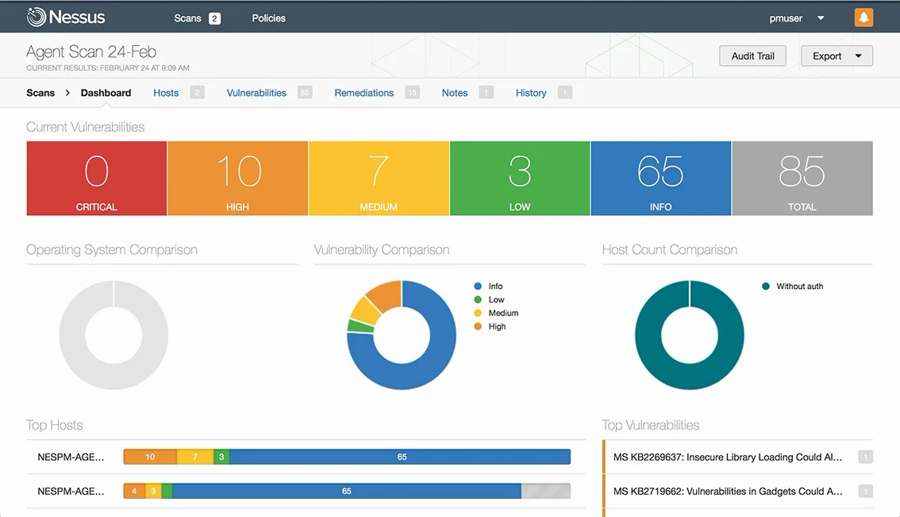</td>
    <td>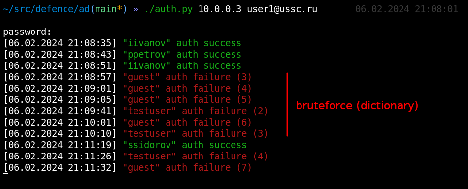</td>
 </tr>
</table>

Direct brute force of domain accounts is very rare and is more likely to be the result of careless attacks. If we see clearly dictionary passwords, then these are most likely echoes of an attack on your external network perimeter (administrator, guest, testuser, test1). But if these are usernames unique to your company (joe.smith, jane.smith), which could only be recognized while inside, then this is already a marker of an internal violator.

The password spraying attack is more realistic because if used correctly, it does not cause blocking. But it will be perfectly visible to us:

<table border="0">
 <tr>
    <td>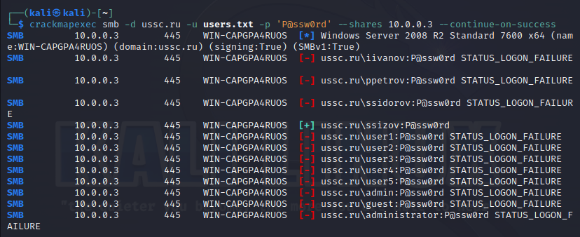</td>
    <td>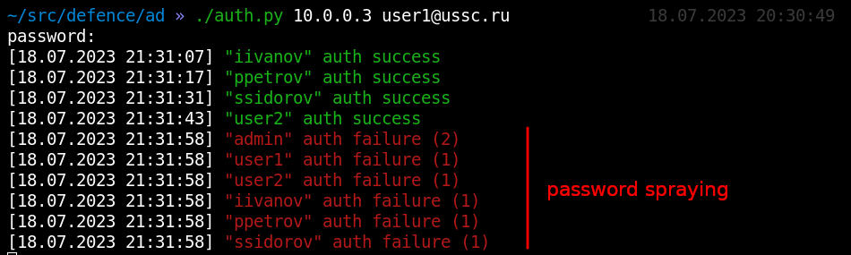</td>
 </tr>
</table>

Using a small analytics script `auth-anal.py` and python's built-in math capabilities we can build simple analytics. And let’s say, based on the surge in blocking at night, we can conclude that someone was guessing the passwords:

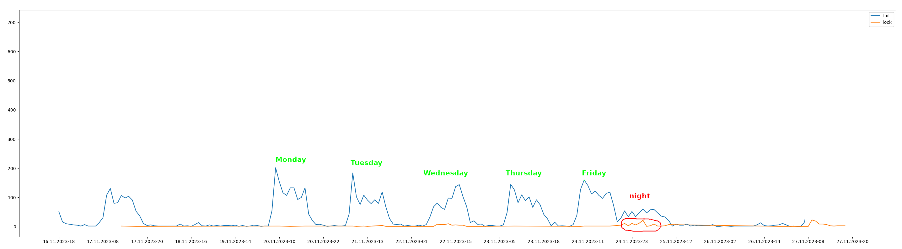

An excellent marker that someone is brute-forceing your accounts is blocking the `Administrator` or the “wrong password” of the `Guest` user. You can also monitor an account that is not used by anyone, any authentication event for which can be considered an anomaly. And it is for these events that the `auth.py` script performs customized notification - `email`, `sms`, `telegram`.

### ad/changes.py

There are a huge number of attacks in Active Directory. And most are united by the fact that each of them leaves traces in the form of corresponding attributes. By monitoring these same attributes via LDAP in real time, we could see any attack almost at the same second, even if the attacker is on the other end of the local network.
This is quite possible and all you need is to be a simple domain user.
Almost any change to anything in an AD object, including ACL modification, changes the whenChanged attribute, by which we can request changed objects in a loop.

As attacks develop in the Active Directory infrastructure, various misconfigurations of access rights are often discovered, as well as relay attacks that allow actions to be performed on behalf of another account. Ultimately, this allows attackers to perform many dangerous actions.
An example of a neat and silent attack on a `user` object is to add a `servicePrincipalName` attribute to it and use a `TargetedKerberoasting` attack to obtain the user's password hash - and we see this attack to create and delete SPN:

<table border="0">
 <tr>
    <td>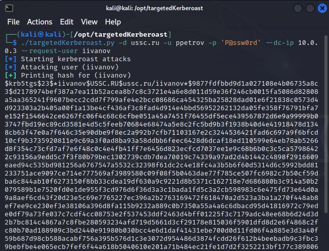</td>
    <td></td>
 </tr>
</table>

If the attacker has write rights to the `computer` account object, then he can use the `RBCD` or `ShadowCredentials` technique to seize access to the victim’s PC. This can be seen by the appearance of the specific attribute `msDS-AllowedToActOnBehalfOfOtherIdentity`/`msDs-KeyCredentialLink`:

<table border="0">
 <tr>
    <td>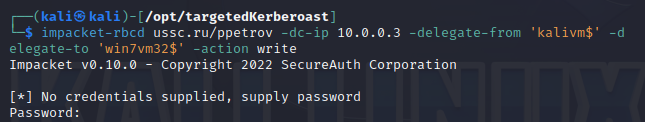</td>
    <td>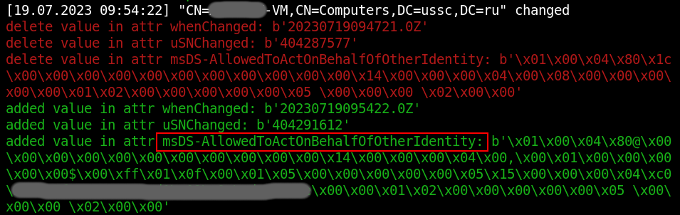</td>
 </tr>
</table>

Finally, attention should also be paid to `group policy objects`. Compromise of this object can have a catastrophic impact if many PCs fall under the group. The most valuable thing in Group Policy is the `gPCFileSysPath` attribute, which points to the folder in which an executable script or registry hive can be stored. The redirect attempt can be detected by the corresponding attribute:

<table border="0">
 <tr>
    <td>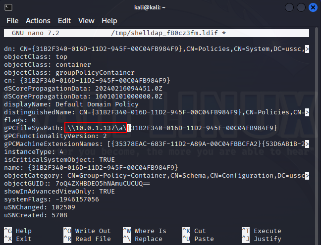</td>
    <td>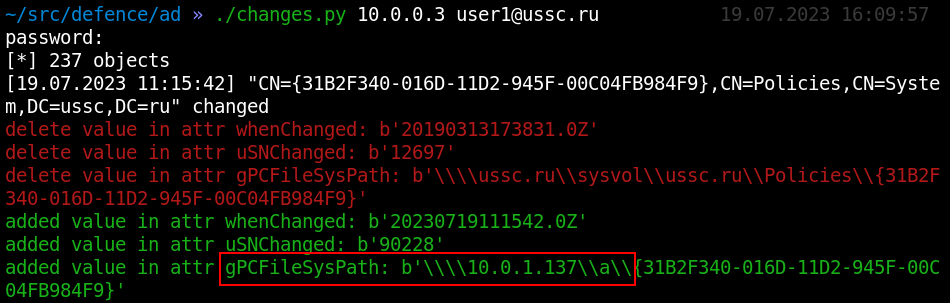</td>
 </tr>
</table>

If an attacker has gained access to a particular `group` that is of interest to him, then the main thing he can do is, of course, add an account to this group. Adding an object to a group occurs through the member attribute, which we will see in the same second:

<table border="0">
 <tr>
    <td></td>
    <td>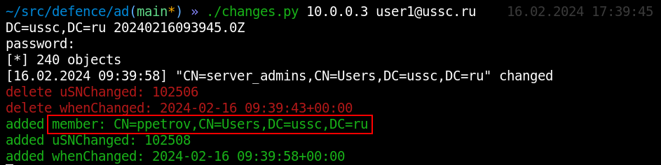</td>
 </tr>
</table>

ACL attacks are perhaps an even more subtle threat. Almost everything that was shown above can be a consequence of the development of misconfigurations of access rights (`ACL`). Well identified with the help of Bloodhound, they are often reliable, invisible paths leading a simple domain user to the kings - to the domain administrator. But are ACL modifications so invisible? In fact, even the slightest change in rights leads to an implicit change in the whenChanged attribute, which means our method will work here too.
If you have the appropriate rights (`GENERIC_ALL`, `WRITE_OWNER`), an insider can `change the owner` of an object. As soon as this happens, the object’s `nTSecurityDescriptor` attribute changes, which stores all information about the rights to this object. Despite the fact that the information in it is presented in binary form, the `changes.py` script can parse its structure to its canonical form. And in this example we immediately see what happened:

<table border="0">
 <tr>
    <td>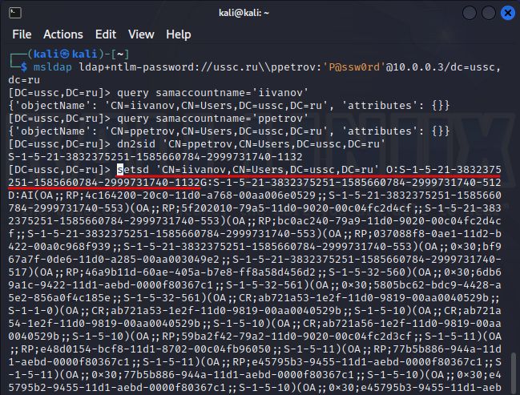</td>
    <td>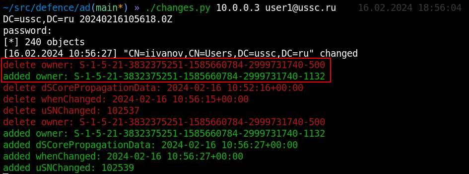</td>
 </tr>
</table>

But the attack rarely stops there and most likely something else must happen. Let's look further.
If an internal attacker discovers that he has rights to some object that allow him to `change permissions`, he can assign an arbitrary right. More often these are simply full rights to the object (`GENERIC_ALL`). This case shows how an insider adds an `ACE` with the mask `GENERIC_ALL` (full control). What we see:

<table border="0">
 <tr>
    <td>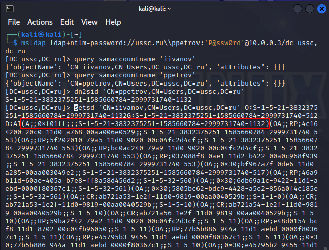</td>
    <td>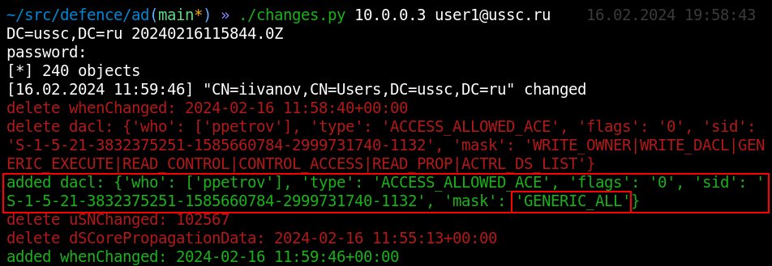</td>
 </tr>
</table>

In real infrastructures, the path from the user to the domain administrator can be very thorny, and I would recommend paying attention to changing the ACL of any object where `GENERIC_ALL` and `WRITE_DACL` occur, since they each have the strongest impact in their own situation.

The `changes.py` script, in just 100+ lines of code, is able, under any even non-privileged domain account, to see in real time which objects were created, deleted or changed. Show exactly which attributes have changed in them, including analysis of the ACL to a canonical, human-readable form.
Just one script, which we will continue to see in almost all attacks, can become an almost universal tool for monitoring Active Directory.

## Wi-Fi level \[external intruder\]

Let's assume that the hacker still did not get into your local network and everything that was described earlier did not happen to you. But he can still get through there with physical attacks, being near your offices.
Wireless networks are the first thing an external intruder will encounter, even if he has not yet managed to get close enough to you. `Wi-Fi` is an extremely common technology, susceptible to a wide variety of known attacks and, importantly, having sufficient ease of implementation. All this makes attacks on your wireless networks very real. Do not underestimate this attack surface, which is actually much more promising for a sufficiently motivated external attacker than your Internet perimeter.
If we talk about protecting wireless networks, then in information security it is usually customary to only give recommendations on secure configuration. While the attacks themselves are considered to be quite silent. Although certain `Wireless IDS` solutions exist, most of which are academic hacks, they are extremely rare in our time. And it turns out to be a rather interesting situation: we have two perimeters: one in the digital space, protected by all sorts of `WAFs`, `SOCs` and other `IDS`/`IPS`, and in the real world - wireless networks that almost always go beyond the controlled area and in no way at all are not really protected.
And therefore, our task will be to try to identify various current attacks only by listening to the radio broadcast.
As already mentioned, it is believed that most attacks on wireless networks are silent and invisible. However, almost all of them have their own characteristics by which we will calculate them.

### wifi/deauth.py

Deauthentication. Any hacker, young or old, who wants to infiltrate you will be located near your office and send out deauthentication packets. The attack is used on `WPA PSK` networks (the most common today) and consists of simultaneously disconnecting the access point and clients from each other. This is achieved by sending special packets in both directions from the names of both parties at once. This causes the client, which did not actually intend to disconnect from the access point, to resend the password hash (handshake) in a second `EAPOL` message. For a hacker, a handshake is of great interest, because it can be used to carry out a password guessing attack using a dictionary at fairly high speeds (millions per second). However, by listening to the radio air we can easily detect such attacks by sending deauthentication packets from two sides at once:

<table border="0">
 <tr>
    <td>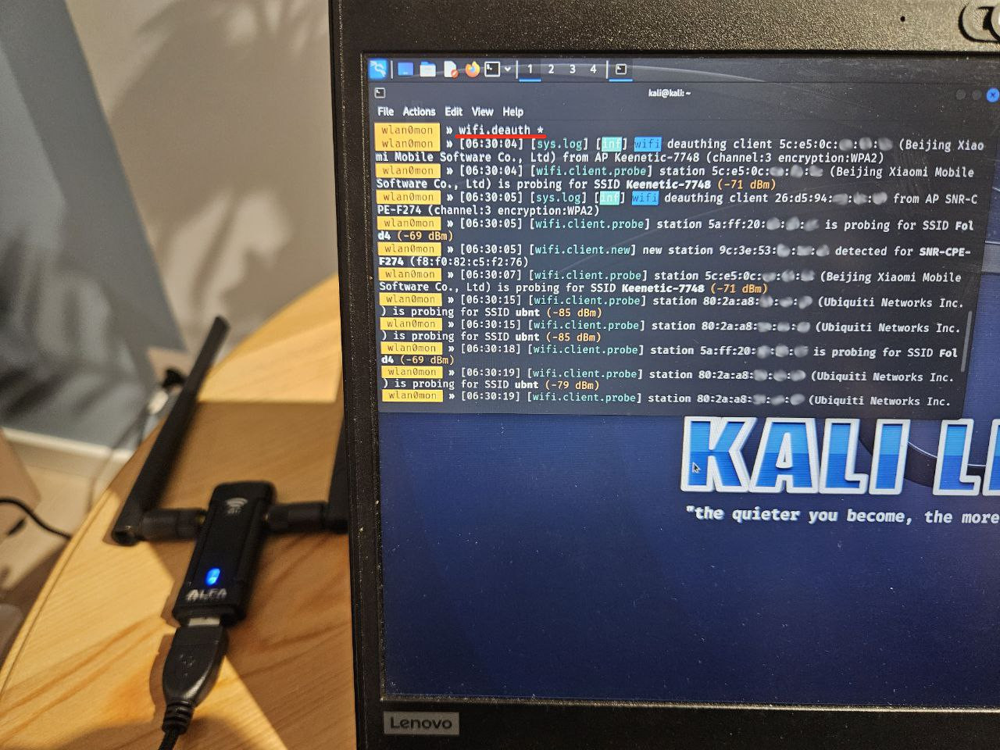</td>
    <td>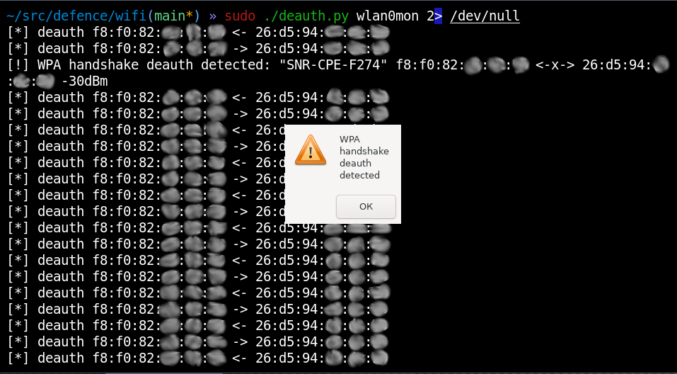</td>
 </tr>
</table>

The signal level will even allow us to understand how close the hacker is to us and -30dBm means that he is actually opposite you.

### wifi/pmkid.py

Corporate wireless networks often use multiple access points with identical names to cover a large area. This creates a seamless transition for employees when they move from one access point's service area to another. On such access points, the first `EAPOL M1` message often contains a `PMKID` hash during authentication, which is almost the same as a `handshake`. Hackers really like this attack for its speed, because the hash comes from the access point itself, which makes it possible to capture the hash and guess the password without interacting with its clients. In addition, this attack is considered to be quite silent, because it does not cause negative consequences. However, there is a peculiarity in its implementation...
Specialized software such as `hcxdumptool` or `bettercap`, in order to avoid capturing an unwanted `EAPOL M2` packet, do not send it as soon as an `EAPOL M1` arrives from the access point. And this is not typical for a legitimate client. This is because otherwise the hacker will capture two different hashes at once, and for example `aircrack-ng` cannot bruteforce `PMKID` in the presence of `EAPOL M2`. This is how this attack can be detected.

<table border="0">
 <tr>
    <td>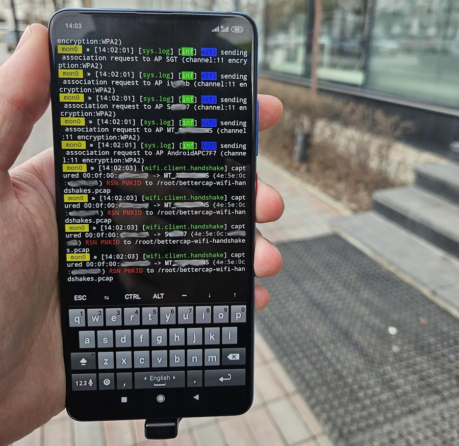</td>
    <td>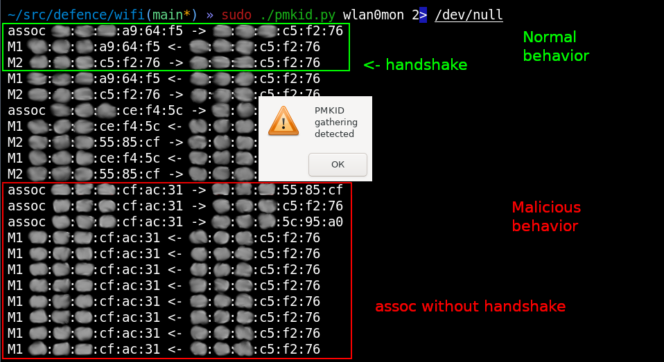</td>
 </tr>
</table>

### wifi/bruteforce.py

If the hacker failed to succeed with the two previous attacks - capturing `handshake` and `PMKID`, which are the most common attacks on WPA PSK, then he can go further. Even if the hacker has a WPA network without a client and without PMKID, it is not protected if its password is 12345678. And the hacker can always pick up the password online - each time asking the password from the access point itself. In addition, he can do this from absolutely any phone, without raising any suspicions.
By monitoring the radio broadcast, we can distinguish successful authentication attempts from unsuccessful ones by sending an `EAPOL M3` packet by the access point. And such a simple check allows us to see the online brute force of the access point.

<table border="0">
 <tr>
    <td>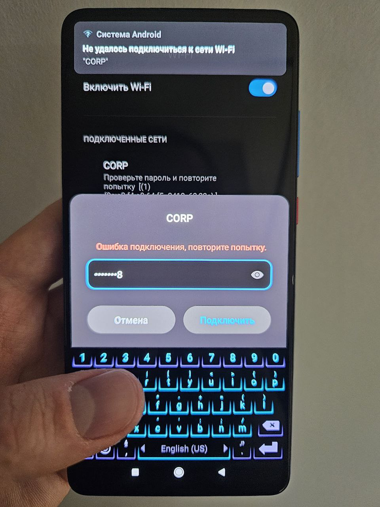</td>
    <td>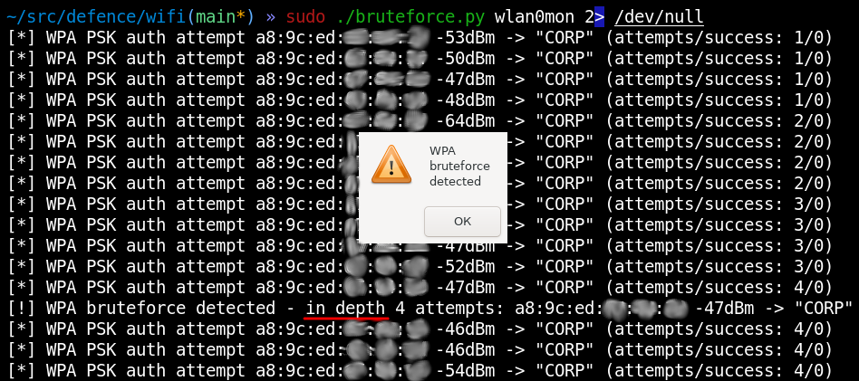</td>
 </tr>
</table>

Often, medium and large companies can have multiple wireless networks. In addition to official access points, there can also be secondary ones (technological, service, test). Finally, wireless printer networks can also become a point of penetration. In turn, their network names may not clearly indicate their affiliation with the company. An experienced hacker, understanding this, is forced to attack all audible wireless networks, making a brute-force attack on a wide range of targets. Such an anomaly is easy to notice, and the `bruteforce.py` script copes with this perfectly.

<table border="0">
 <tr>
    <td></td>
    <td>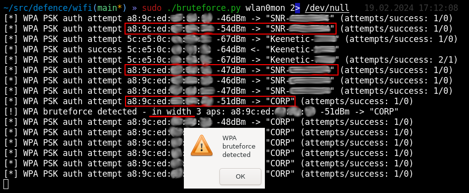</td>
 </tr>
</table>

### wifi/wps.py

Soon.

### wifi/eviltwin.py

As Kevin Mitnick said, a person is the most vulnerable link in any system. Hackers of all stripes love this attack, because it is aimed at human weakness. And such an attack will always be relevant. Novice hackers can start with this attack right away, and more experienced ones, only if all previous ones have failed.
A hacker can simply launch a wireless open network with a name identical to the network being attacked. Implement his `captive portal` and lure certain data from the victim who connects to it.
It is quite easy to detect such an attack. We simply monitor all `WPA` networks and compare whether there is a similar `OPN` network.
The presence of two identical networks with different authentication parameters is an anomaly, because wireless clients cannot remember two different networks with the same name. This is a clear sign of an `EvilTwin` attack.

<table border="0">
 <tr>
    <td>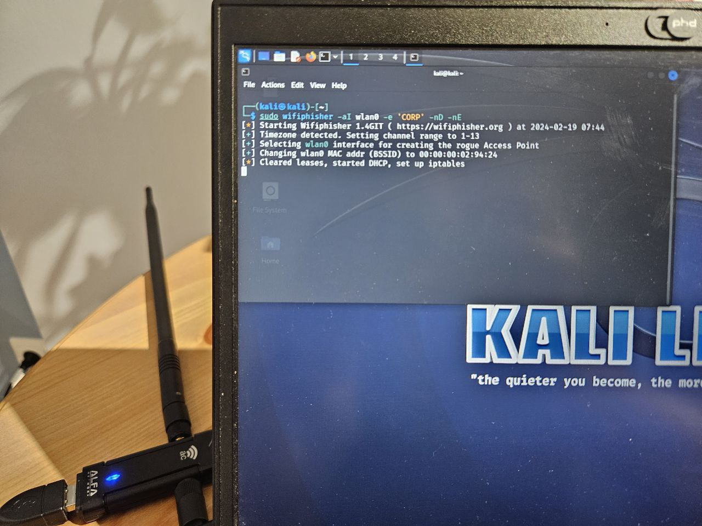</td>
    <td>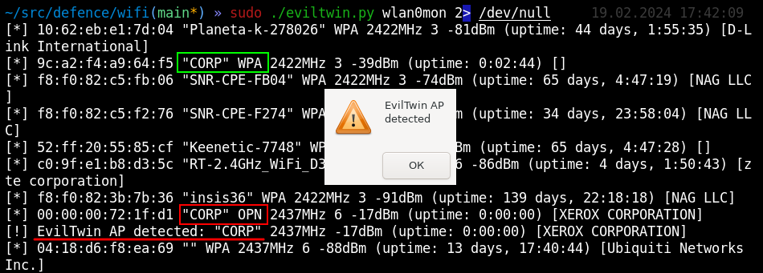</td>
 </tr>
</table>

Since this attack belongs to the `Roque AP` class, the script records all `uptime` and `vendors`. An extremely low uptime confirms that the wireless network was just turned on by the hacker.

### wifi/eap.py

Typically, companies use `WPA Enterprise` networks, where each client has their own personal login and password.
WPA Enterprise wireless networks use a separate authentication server and support multiple methods of accepting credentials from the client. And some of them are so insecure that they can force the client to send the password in plain text or as a hash. A hacker can simply launch a wireless network identical to the legitimate one and activate the most insecure authentication methods.
For a legitimate network, the order of proposed authentication methods is from the most secure to the least. But for a hacker's wireless network - vice versa. This is the essence of the `GTC downgrade` attack.
It is the first most insecure `GTC` method that is the marker for detecting this attack. The script monitors only WPA EAP networks and authenticates on each newly heard one to check the authentication methods. And as soon as a hacker nearby launches `eaphammer`, we immediately detect it.

<table border="0">
 <tr>
    <td>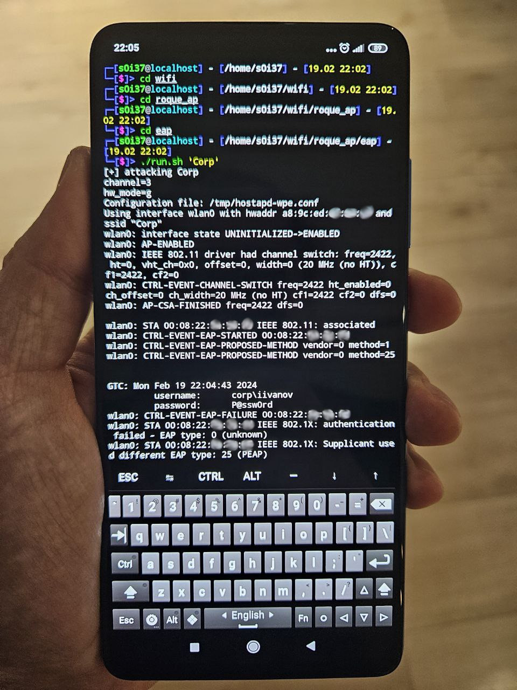</td>
    <td>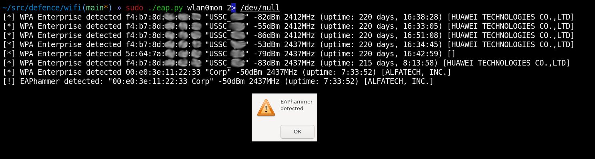</td>
 </tr>
</table>

In addition to the low `uptime`, we can see the `vendor` characteristic of hacker Wi-Fi adapters, as well as the signal level, indicating that the hacker is somewhere nearby.

### wifi/karma.py

Detection of the `KARMA` technique will finally finish off wireless hackers. After all, this technique is found explicitly and implicitly in almost all hacker tools. And somewhere it is default, which only increases the chances of detection.
The KARMA technique is used to attract clients by sending them spoofed `Probe Response` packets. Using Probe packets is an alternative way to search for wireless networks, usually used for energy saving purposes. This technique allows hacker to connect many clients, regardless of the name of the wireless network.
In some ways, this attack resembles `responder` and its effective detection can be performed in the same simple way. We periodically send `Probe Request` on the radio with a random non-existent name. A legitimate access point will never respond to such a packet. But the essence of the KARMA attack is to respond to all such requests, which is how a specialized hacker access point gives itself away.

The `hcxdumptool` utility activates the KARMA technique by default. And if a hacker wanted to collect a `handshake` or `PMKID`, he gave himself away with this technique.

<table border="0">
 <tr>
    <td>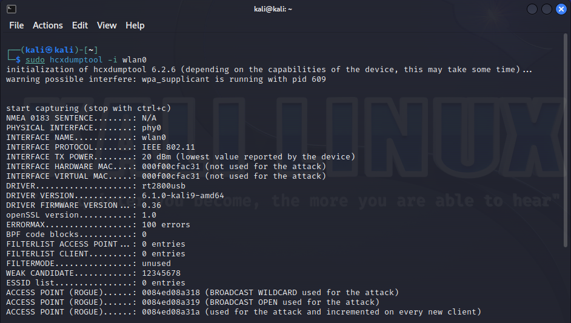</td>
    <td>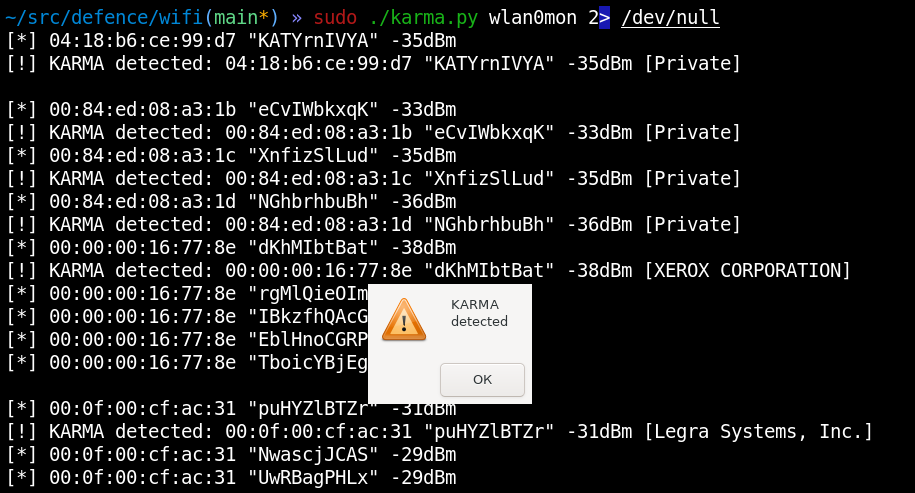</td>
 </tr>
</table>

If a hacker tried to attack a WPA EAP network using `eaphammer`, he would also get caught, because KARMA is also used there by default.

<table border="0">
 <tr>
    <td>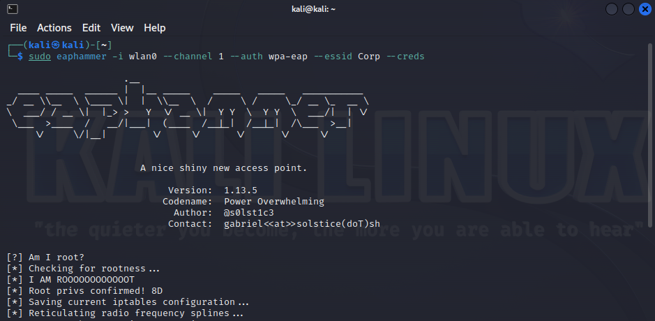</td>
    <td></td>
 </tr>
</table>

If a hacker performs an `EvilTwin` attack using `wifiphisher`, there will be an instant detection, because here too KARMA is used by default.

<table border="0">
 <tr>
    <td></td>
    <td></td>
 </tr>
</table>

Finally, the pure KARMA attack is used in `hostapd-mana`, a specially modified tool of the same name. And again - detection.

<table border="0">
 <tr>
    <td>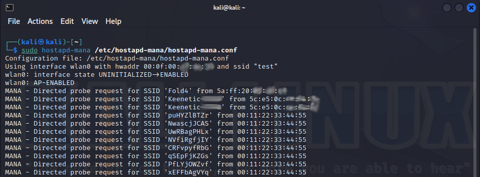</td>
    <td></td>
 </tr>
</table>

## POST

Finally, what to do if the hacker has achieved his goal and managed to penetrate the system? Then make his life at least a little more difficult.
If a hacker gets to your computer, then most likely he will only be interested in your password. And you as a user can come up with any password, even if it contains wildcards and the use of dangerous commands. Thus, it is in your power to make `RCE` in a hacker machine.

<table border="0">
 <tr>
    <td>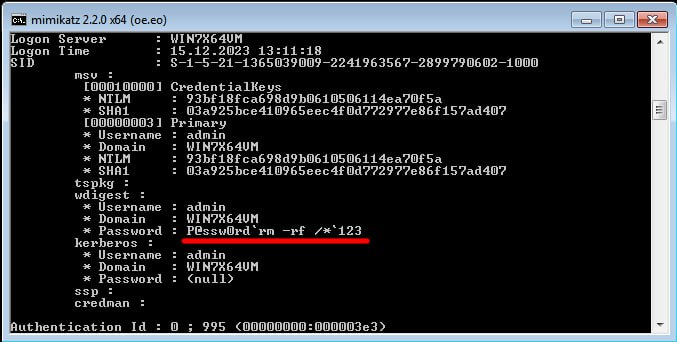</td>
    <td>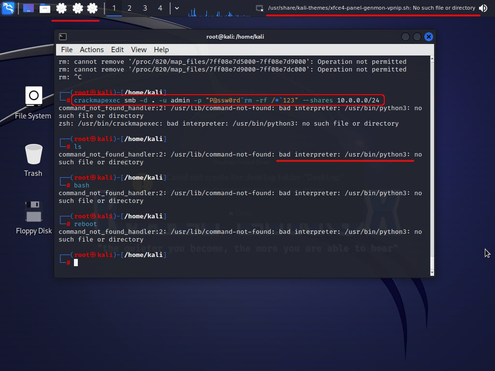</td>
 </tr>
</table>

According to a survey conducted among hackers, pentesters and IT specialists, 21% incorrectly entered the password in the command line, killing their `Kali` during a `password reuse attack`. A simple recommendation was able to stop 1 hacker out of 5.
There is no guarantee whether it will work or not, but it will definitely not make your password weaker =)
