[English version](README.md)

# Хакерские приёмы защиты
Простые технические приемы, позволяющие обнаружить, изучить, а иногда помешать хакерам на разных стадиях проникновения.
Все представленные приемы не требуют исключительных прав и могут выполняться обычным сотрудником – защитить свою компанию может каждый.

## Периметр в сети Интернет \[внешний нарушитель\]
Злоумышленник ещё только собирается проникнуть в вашу сеть. Пока его и вас разделяют тысячи километров и десятки промежуточных сетевых устройств.

Приёмы встречной разведки хакеров.

### proto.py

Хакер пока ничего не знает о вашем периметре и только собирается провести свою первую активную разведку — сканирование портов. Его цель — обнаружить открытые порты и идентифицировать сервисы. Мы можем воспользоваться базой данных той самой программы, которую он использует для сканирования (nmap) и посмотреть, какие протоколы он пытается искать. Скрипт `proto.py` делает эту работу. Он прослушивает указанный сетевой порт (TCP или UDP) и показывает, на что наиболее похож полученный буфер данных:


Приём чего-то необычного на прослушивающий порт является свидетельством активной разведки хакера. Однако Интернет — очень враждебная сеть, и в действительности мы почти каждую секунду будем получать случайные пакеты из разных уголков планеты. И большая часть активности исходит не от хакеров, а от простых ботов.

### ip_id.py
Сетевой стек TCP/IP, который соединяет злоумышленника с его целью, имеет несколько примечательных особенностей, которые можно использовать для воссоздания картины источника атаки – откуда и как он исходит. На уровне IP сетевого пакета есть поле ID, которое в большинстве операционных систем имеет глобальный инкрементальный характер. Другими словами, компьютер хакера, отправляя сетевые пакеты своим целям, увеличит это поле на единицу. Анализируя это поле в полученных от хакера пакетах, мы можем увидеть, сколько пакетов он отправляет куда-то еще, кроме нас. Другими словами, мы можем сделать некоторый вывод, является ли атака целевой или распространяется на множество хостов.

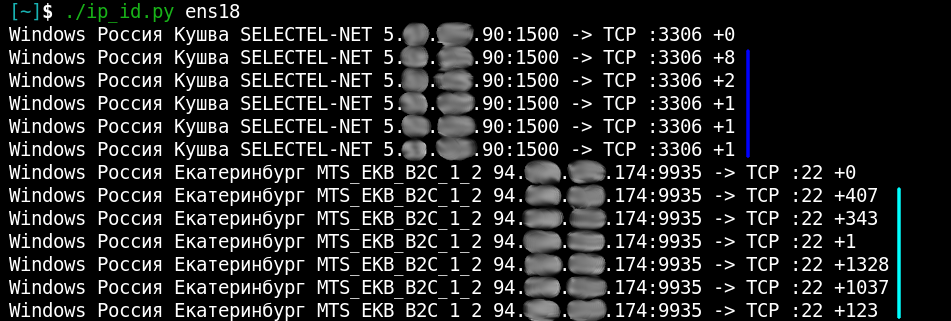

В этом примере видно, что первый источник трафика имеет слабое приращение IP.id, что означает, что он не отправляет пакеты практически никому, кроме нашего узла — это говорит о вероятной целенаправленной атаке. Второй узел, кроме нас, успевает отправить от нескольких сотен до тысячи пакетов — это говорит о вероятной веерной атаке сразу на множество узлов.

### nat.py

Каждый сетевой пакет на уровне IP имеет поле TTL, которое уменьшается на 1 каждый раз, когда пакет проходит через сетевое устройство (коммутатор). Таким образом, анализируя значение этого поля в полученных от хакера пакетах, мы можем сделать вывод, насколько далеко он от нас. Но из этого поля мы также можем сделать вывод, где именно находится хакер — на узле с белым IP (как выделенный сервер) или за NAT или VPN (как рабочая станция). Для этого необходимо отправить пинг-запрос источнику трафика и сравнить разницу IP.TTL для входящих и исходящих пакетов. Если пакет в нашу сторону прошел большее расстояние (его TTL уменьшился сильнее), то IP-адрес источника трафика не является реальным адресом хакера, а является лишь NAT-шлюзом или VPN. Если расстояния туда и обратно совпадают, то этот IP-адрес является истинным источником трафика.

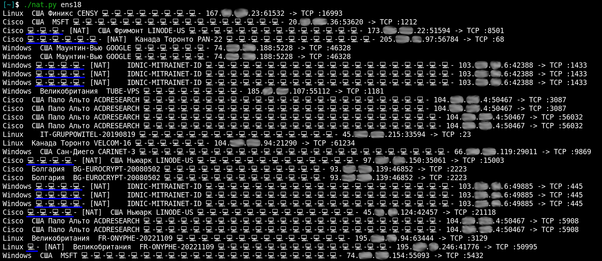

Если источник трафика находится в локальной сети, то по по IP.TTL мы можем посмотреть, насколько глубоко он там находится, и соответственно примерно судить о размере локальной сети. Зачастую вредоносная активность из недр локальных сетей не является преднамеренной атакой, а является следствием заражения вирусом одного из компьютеров какой-либо компании и попытки его распространения.

### uptime.py

В протоколе TCP скрыто одно очень интересное поле – опция `timestamp`, по которой можно рассчитать время, когда была загружена ОС. Такая информация встречается не только при исходящих подключениях, но и при входящих. То есть большинство из тех узлов, что посылают на нас трафик и как-то пытаются атаковать, бессознательно разглашают в TCP-пакетах свои uptime. Не на всех типах ОС это поле фактически совпадает с временем загрузки, но важно другое – оно постоянное и достаточно уникально для каждого компьютера. А значит оно, подобно уникальному хэшу, способно выделить трафик произвольного ПК из общей массы, вне зависимости от его IP.
Скрипт `uptime.py` пассивно слушает сетевой трафик и показывает значение uptime для всех входящих пакетов. И с помощью этой информации можно:

1. Узнать является ли тот или иной IP-адрес фактическим источником трафика. Для этого нужно сравнить uptime в пакетах приходящих с него, с uptime который можно запросить на любом открытом порту. На рисунках ниже два случая, когда uptime совпал и не совпал:

<table border="0">
 <tr>
    <td>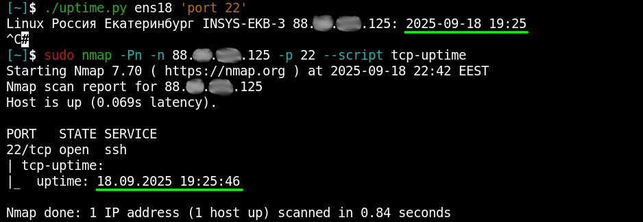</td>
    <td>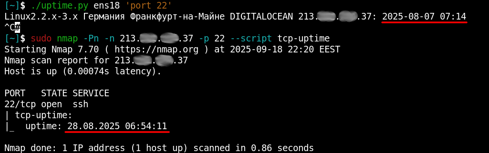</td>
 </tr>
</table>

В первом случае uptime полностью совпал - это означает, что активность исходит непосредственно с этого IP. Во втором случае uptime не совпал - это означает что данный IP-адрес является NAT или VPN шлюзом и только пересылает на вас чей-то трафик. Аналогичная информация так же может быть получена с помощью скрипта `nat.py`.

2. Увидеть, сколько фактических источников трафика находится за IP-адресом. Для этого нужно лишь по-мониторить некоторое время uptime, приходящие с этого узла:

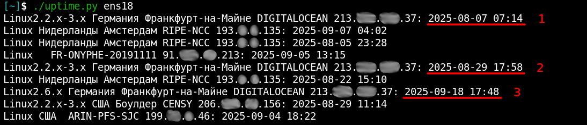

Можно видеть, минимум три различных uptime с одного и того же IP-адреса. Это означает, что данный узел является шлюзом и за ним находится три ПК (три хакера).


3. Понять, что те или иные разные IP-адреса – это фактически один и тот же компьютер:

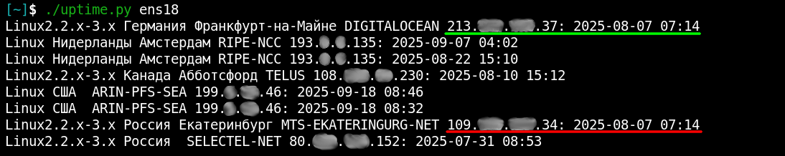

Если хакер по неосторожности допустит утечку вне VPN всего одного TCP-пакета, этого может быть достаточным для сопоставления uptime его настоящего и анонимного IP-адресов. Так легко может быть сделан деанон атакующего.


Приёмы противодействия.
Представленные ниже приёмы - это скорее не классические методы пассивной защиты, а подходы по активному противодействию.

### services.py

Обычно хакеров интересуют не открытые порты, а службы их прослуживающие. С помощью особых запросов хакер вынуждает службу ответить и выдать тем самым тип службы, протокол, ПО или даже версию. Скрипт `services.py` умеет отвечать на такие запросы таким образом, что бы сканирующее ПО определяло это как тот или иной случайный сервис. Скрипт слушает только один указанный порт, но если перенаправить в него все 65к незанятых портов, то хакер увидит следующую картину:

<table border="0">
 <tr>
    <td>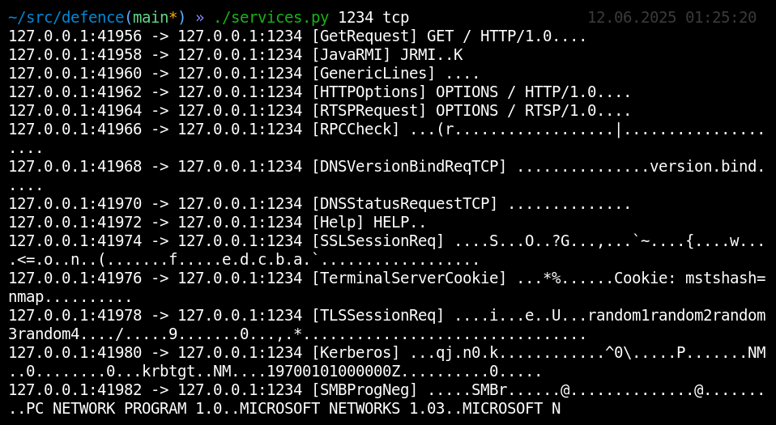</td>
    <td>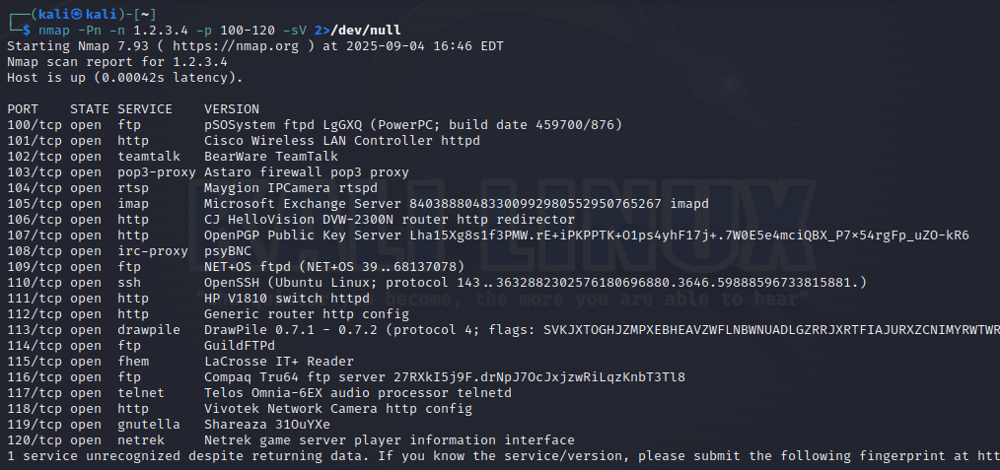</td>
 </tr>
</table>

Подобный приём сильно осложнит хакеру идентификацию истинных сервисов.

### garbage.py

Хакерские сканеры портов, как и любое другое ПО, могут быть склонны к утечкам памяти и отказу в обслуживании (DoS), если им начать отправлять данные, которые те неожидают. Скрипт `garbage.py` использует этот недостаток и отправляет в ответ сканеру портов бесконечный поток специальных байт, который вызывает утечку всей доступной RAM и в конечном счёте аварийное завершение:

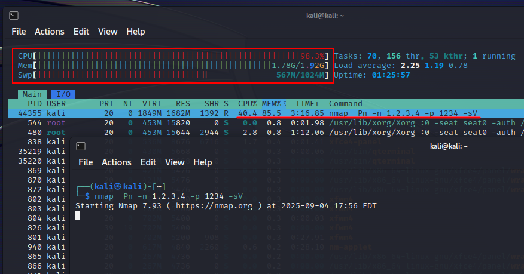

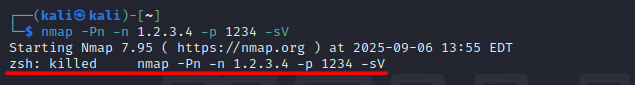

Несмотря на то, что аварийно завершается только процесс сканера портов, он успевает выделить всю доступную RAM, что вызывает вытеснение памяти всех других процессов в файл подкачки (SWAP), а также сброс дискового кэша. В конечном счёте после аварийного завершения процесса сканера, вся система на некоторое время может испытать некоторую задержку в работе.
Исчерпывание всей RAM атакующему в этом случае потребует отправки ему достаточно большого объема трафика, что может быть не всегда уместным. Поэтому другой способ противодействия идентификации служб не исчерпание памяти, а экстремальное замедление этого процесса. Скрипт `garbage.py` так же умеет отвечать сканерам портов особым образом, отправляя всего один байт в секунду, и вызывая зависание процесса идентификации службы:

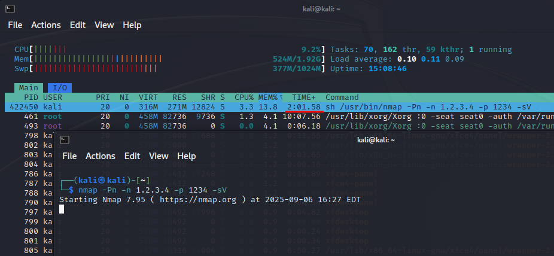

Автоматические сканирующие конвейеры (боты), которые скорее всего вас и сканируют, могут либо аварийно завершиться либо сильно замедлить свою работу.

### zip_bomb.py

Протокол HTTP, на котором реализовано 90% технологий периметра любой компании, позволяет отправлять данные используя сжатие. В случае если передаваемые данные состоят всего из одного символа, степень сжатия может иметь 1000-кратную величину. Иными словами отправка хакеру сжатого HTTP ответа размером в 10МБ, вызовет автоматическое исчерпание 10ГБ его RAM. Скорее всего это приведет к аварийному завершению любого сканирующего процесса. Скрипт `zip_bomb.py` умеет отвечать HTTP-содержимым с 1000-кратным сжатием указанного размера.

Специализированные утилиты (`dirsearch`, `wfuzz`, `ffuf`), которые хакеры используют для "простукивания" каталогов сайтов, подвержены этой проблеме и при отправке всего одного HTTP-ответа они аварийно завершаются, исчерпав всю доступную RAM:

<table border="0">
 <tr>
    <td>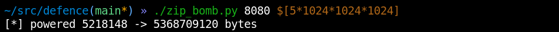</td>
    <td>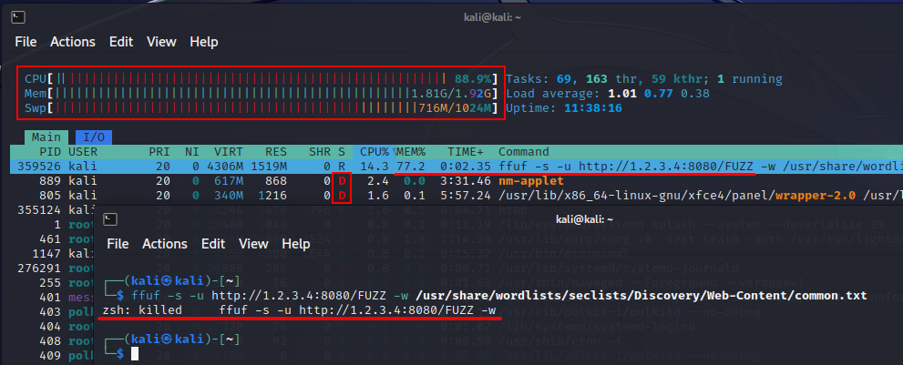</td>
 </tr>
</table>

У ОС Linux, с которой наверняка хакер вас атакует, есть известная проблема механизма OOM Killer, при которой утечка памяти приводит к сильному замедлению системы вплоть до полного зависания ОС. И подвержены ей главным образом браузеры. В случае если хакер откроет ваше веб-приложение в браузере, то его ОС может намертво зависнуть вплоть до полной принудительной перезагрузки системы с потерей всех несохраненных данных:

<table border="0">
 <tr>
    <td></td>
    <td>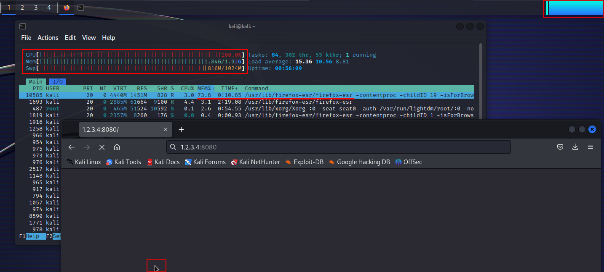</td>
 </tr>
</table>

Такой же проблеме подвержены и сканеры веб-уязвимостей:

<table border="0">
 <tr>
    <td></td>
    <td>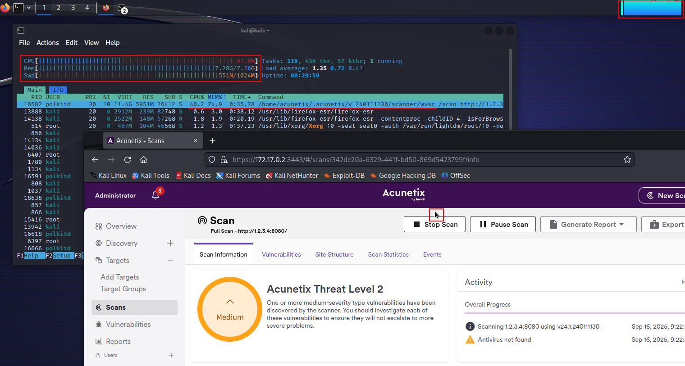</td>
 </tr>
</table>

## Периметр беспроводных сетей \[внешний нарушитель\]

Предположим, что хакер так и не проник в вашу локальную сеть и все, что было описано ранее, с вами не произошло. Но он все равно может проникнуть туда физическими атаками, находясь рядом с вашими офисами.
Беспроводные сети – первое, с чем столкнется внешний злоумышленник, даже если он еще не успел подобраться к вам достаточно близко. `Wi-Fi` — чрезвычайно распространенная технология, подверженная множеству известных атак и, что немаловажно, имеющая достаточную простоту реализации. Все это делает атаки на ваши беспроводные сети вполне реальными.
Если говорить о защите беспроводных сетей, то в информационной безопасности обычно принято давать только рекомендации по безопасной настройке. При этом сами атаки считаются достаточно бесшумными. Хотя существуют определенные решения «Wireless IDS», в наше время они крайне редки. И получается парадоксальная ситуация: у нас есть два периметра: в цифровом пространстве, защищенный разнообразными решениями `WAF`, `SOC`, `IDS`/`IPS`, и в реальном мире — беспроводные сети, которые практически всегда выходят за пределы контролируемой зоны и никаким образом не мониторятся.
И поэтому нашей задачей будет попытаться выявить различные текущие атаки, только прослушав радиопередачу.
Как уже упоминалось, считается, что большинство атак на беспроводные сети бесшумны и невидимы. Однако почти все они имеют свои особенности, по которым мы будем их рассчитывать.

Приёмы обнаружения атак (Wireless IDS).

### wifi/deauth.py

Деаутентификация. Любой хакер, опытный или нет, который захочет проникнуть в ваш офис, будет находиться рядом с вашим офисом и рассылать пакеты деаутентификации. Атака используется в сетях `WPA PSK` (наиболее распространенная на сегодняшний день) и заключается в одновременном отключении точки доступа и клиентов друг от друга. Это достигается за счет отправки специальных пакетов в обе стороны от имен обеих сторон одновременно. Это приводит к тому, что клиент, который на самом деле не намеревался отключаться от точки доступа, повторно отправляет хэш пароля (handshake) во втором сообщении `EAPOL`. Для хакера `handshake` представляет большой интерес, поскольку с его помощью можно провести атаку по подбору пароля с использованием словаря на достаточно высоких скоростях (миллионы в секунду). Однако, прослушивая радиоэфир, мы можем легко обнаружить такие атаки, фиксируя пакеты деаутентификации сразу с двух сторон:

<table border="0">
 <tr>
    <td></td>
    <td></td>
 </tr>
</table>

Уровень сигнала даже позволит нам понять, насколько близко к нам находится хакер, и -30dBm означает, что он фактически находится напротив вас.

### wifi/pmkid.py

Корпоративные беспроводные сети часто используют несколько точек доступа с одинаковыми именами для покрытия большой территории. Это обеспечивает плавный переход сотрудников при переходе из зоны обслуживания одной точки доступа в другую. В таких точках доступа первое сообщение `EAPOL M1` часто содержит хэш `PMKID` во время аутентификации, что почти то же самое, что и `handshake`. Хакерам эта атака очень нравится своей скоростью, поскольку хеш поступает от самой точки доступа, что позволяет перехватить хэш и подобрать пароль, не взаимодействуя с клиентами. Кроме того, эта атака считается достаточно тихой, поскольку не вызывает негативных последствий. Однако в её реализации есть одна особенность...
Специализированное программное обеспечение, такое как `hcxdumptool` или `bettercap`, чтобы избежать перехвата нежелательного пакета `EAPOL M2`, не отправляет его сразу после получения `EAPOL M1` от точки доступа. А это нетипично для легитимного клиента. Это связано с тем, что в противном случае хакер захватит два разных типа хеша одновременно, и, например, `aircrack-ng` не сможет перебрать PMKID при наличии EAPOL M2. Вот как можно обнаружить эту атаку.

<table border="0">
 <tr>
    <td></td>
    <td></td>
 </tr>
</table>

### wifi/bruteforce.py

Если хакеру не удалось добиться успеха с двумя предыдущими атаками — захватом `handshake` и `PMKID`, которые являются наиболее распространенными атаками на WPA PSK, то он может пойти дальше. Даже если у хакера есть WPA-сеть без клиента и без PMKID, она не защищена, если ее пароль 12345678. И хакер всегда может подобрать пароль онлайн — каждый раз спрашивая пароль у самой точки доступа. При этом он может сделать это абсолютно с любого телефона, не вызывая при этом никаких подозрений.
Прослушивая радиоэфир, мы можем отличить успешные попытки аутентификации от неудачных, по отправке точкой доступа пакета `EAPOL M3`. И такая простая проверка позволяет нам увидеть онлайн-перебор точки доступа.

<table border="0">
 <tr>
    <td></td>
    <td></td>
 </tr>
</table>

Часто средние и крупные компании могут иметь несколько беспроводных сетей. Помимо официальных точек доступа могут быть и второстепенные (технологические, сервисные, тестовые). Наконец, точками проникновения могут стать сети беспроводных принтеров. В свою очередь, их сетевые названия могут не четко указывать на их принадлежность к компании. Опытный хакер, понимая это, вынужден атаковать все слышимые беспроводные сети, совершая брутфорс-атаку по широкому кругу целей. Такую аномалию легко заметить, и скрипт `bruteforce.py` прекрасно с этим справляется:

<table border="0">
 <tr>
    <td></td>
    <td></td>
 </tr>
</table>

### wifi/wps.py

WPS позволяет подключиться к сети WPA PSK более простым способом – путем ввода 8-значного цифрового кода. Эта технология имеет 4 уязвимости. Первая уязвимость встречается в WPS v1 и заключается в отсутствии блокировки при попытке использования всего диапазона PIN-кодов (11 000 комбинаций). Отслеживая сообщения EAPOL, скрипт `wps.py` сообщает нам, когда злоумышленник перебирает WPS, когда он подобрал первую половину и, наконец, когда он угадал код.

<table border="0">
 <tr>
    <td>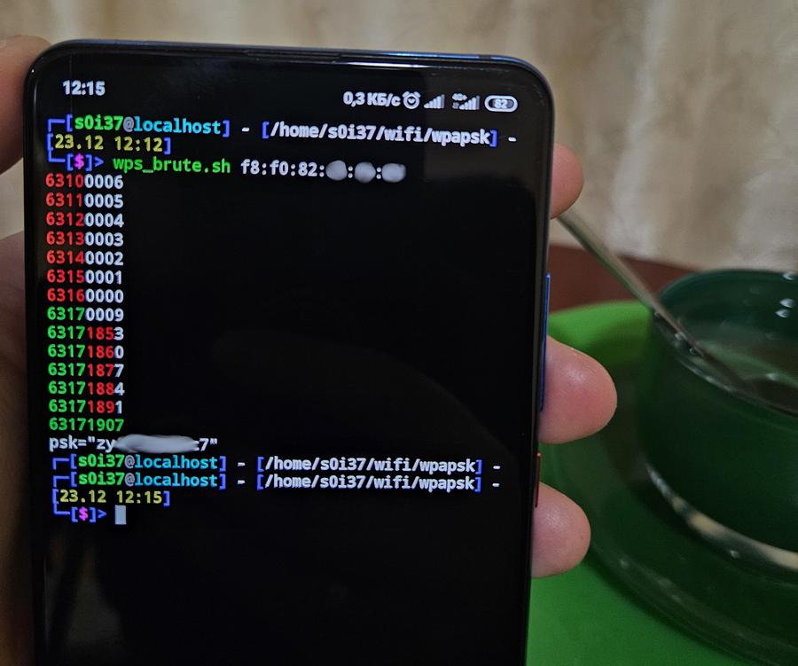</td>
    <td>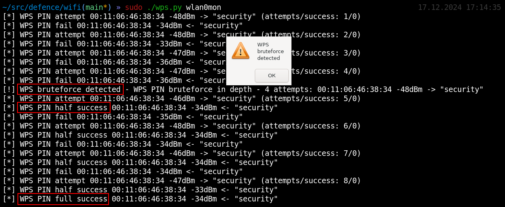</td>
 </tr>
</table>

Последние три уязвимости позволяют угадать ПИН-код без полного перебора всего диапазона из-за слабой криптографии в точке доступа, предсказуемости ПИН-кода на основе MAC-адреса или использования пустого ПИН-кода. А поскольку эксплуатация уже не требует много времени, злоумышленник может проверить эти уязвимости на всех слышимых точках доступа. Скрипт `wps.py` отслеживает такие аномалии, если один и тот же клиент пытается выполнить поиск PIN-кода в нескольких точках доступа одновременно.

<table border="0">
 <tr>
    <td>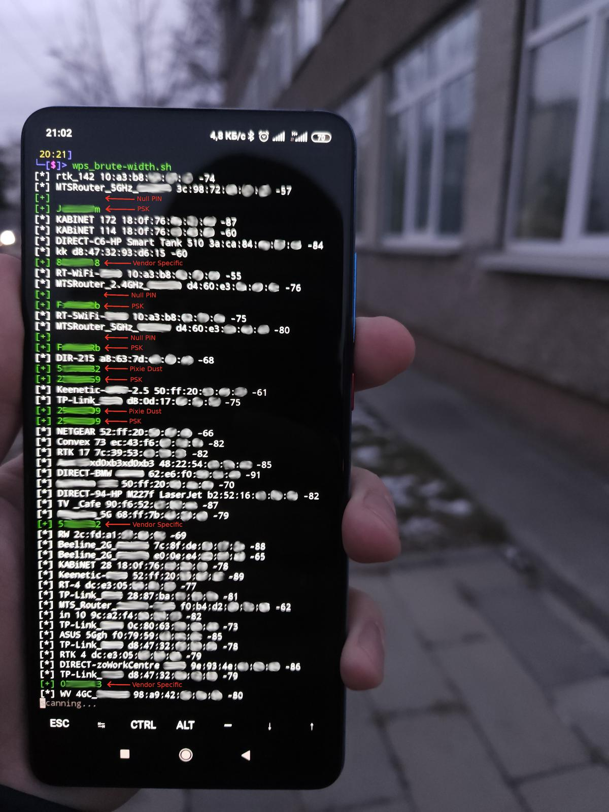</td>
    <td>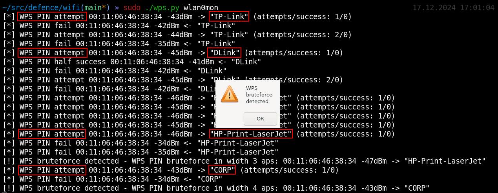</td>
 </tr>
</table>

### wifi/eviltwin.py

Как сказал Кевин Митник, человек – самое уязвимое звено в любой системе. Хакеры всех мастей любят эту атаку, ведь она направлена на человеческие слабости. И такая атака всегда будет актуальна. Начинающие хакеры могут приступить к этой атаке сразу, а более опытные — только в том случае, если все предыдущие не увенчались успехом.
Хакер может просто запустить беспроводную открытую сеть с именем, идентичным атакуемой сети. Внедрить свой `captive portal` и выманить определенные данные у жертвы, которая к нему подключится.
Обнаружить такую атаку довольно легко, поскольку рядом с легитимными точками доступа появляется ещё одна с тем же именем, но другими параметрами безопасности. Мы просто отслеживаем все сети `WPA` и сравниваем, существует ли аналогичная сеть `OPN`.
Наличие двух одинаковых сетей с разными параметрами аутентификации является аномалией, поскольку беспроводные клиенты не могут запомнить две разные сети с одинаковым именем. Это явный признак атаки `EvilTwin`.

<table border="0">
 <tr>
    <td></td>
    <td></td>
 </tr>
</table>

Поскольку эта атака относится к классу `Roque AP`, скрипт показывает `uptime` и `vendor` каждой точки доступа. Чрезвычайно низкое время uptime подтверждает, что хакер только что включил беспроводную сеть.

### wifi/eap.py

Обычно компании используют сети `WPA Enterprise`, где каждый клиент имеет свой личный логин и пароль.
Беспроводные сети WPA Enterprise используют отдельный сервер аутентификации и поддерживают несколько методов приема учетных данных от клиента. А некоторые из них настолько небезопасны, что могут заставить клиента отправить пароль в виде обычного текста или хэша. Хакер может просто запустить беспроводную сеть, идентичную легитимной, и активировать самые небезопасные методы аутентификации.
Для легальной сети предлагаемые методы аутентификации располагаются в порядке от наиболее безопасного к наименее безопасному. А вот для хакерской беспроводной сети – наоборот. В этом суть атаки `понижения GTC`.
Первый наиболее небезопасный метод `GTC`, как раз является маркером обнаружения этой атаки. Скрипт отслеживает только сети WPA EAP и аутентифицирует каждую вновь услышанную сеть, чтобы проверить методы аутентификации. И как только хакер поблизости запускает `eaphammer`, мы его тут же обнаруживаем:

<table border="0">
 <tr>
    <td></td>
    <td></td>
 </tr>
</table>

Помимо низкого `uptime` мы можем видеть значения `vendor` хакерских Wi-Fi адаптеров, а также уровень сигнала, указывающий на то, что хакер где-то рядом.

### wifi/karma.py

Обнаружение техники `КАРМА` окончательно добьет беспроводных хакеров. В конце концов, этот прием явно и неявно присутствует практически во всех хакерских инструментах. А где-то оно стоит по умолчанию, что только увеличивает шансы на обнаружение.
Техника KARMA используется для привлечения клиентов путем отправки им поддельных пакетов `Probe Response`. Использование пакетов Probe — это альтернативный способ поиска беспроводных сетей, обычно используемый в целях энергосбережения. Эта техника позволяет хакеру подключить множество клиентов, независимо от названия беспроводной сети.
В чем-то эта атака напоминает `responder`, и ее эффективное обнаружение может быть выполнено таким же простым способом. Мы периодически отправляем в радиоэфир `Probe Request` со случайным несуществующим именем. Легитимная точка доступа никогда не ответит на такой пакет. Но суть атаки KARMA заключается в том, чтобы ответить на все подобные запросы, чем и выдает себя специализированная хакерская точка доступа.

Утилита `hcxdumptool` по умолчанию активирует технику KARMA. И если хакер хотел получить `handshake` или `PMKID`, он выдал себя с помощью этой техники:

<table border="0">
 <tr>
    <td></td>
    <td></td>
 </tr>
</table>

Если хакер попытается атаковать сеть WPA EAP с помощью `eaphammer`, его тоже поймают, поскольку там по умолчанию также используется KARMA:

<table border="0">
 <tr>
    <td></td>
    <td></td>
 </tr>
</table>

Если хакер выполнит атаку `EvilTwin` с использованием `wifiphisher`, произойдет мгновенное обнаружение, поскольку и здесь по умолчанию используется KARMA:

<table border="0">
 <tr>
    <td></td>
    <td></td>
 </tr>
</table>

Наконец, чистая атака KARMA используется в `hostapd-mana`, специально модифицированном одноименном инструменте. И снова - обнаружение:

<table border="0">
 <tr>
    <td></td>
    <td></td>
 </tr>
</table>

### wifi/timing.py

Все атаки выполняемые с позиции клиента и направленные на точку доступа, как правило, требуют от атакующего создания особых пакетов, которые невозможно отправить силами непосредственно самого Wi-Fi адаптера. Поэтому различные хакерские утилиты отправляют эти пакеты, создавая их самостоятельно с нуля, тогда как легитимные пакеты генерируются напрямую Wi-Fi чипом. Как правило, это создаёт заметную разницу во времени, так как сырому пакету нужно пройти куда больший путь: user space -> kernel -> Wi-Fi чип.
Всякое подключение к точке доступа это всегда чёткая последовательность этапов аутентификации, ассоциации и так далее. И достигается это соответствующими парами запроса-ответа: auth_req/auth_resp, assoc_req/assoc_resp, ident_req/ident_resp, m1/m2. У легитимных клиентов разница во времени между переходами по этапам request/response составляет несколько миллисекунд, тогда как хакерские инструменты, как правило, имеют задержку в десятки миллисекунд, а иногда и больше.
Скрипт `timing.py` умеет детектировать такие небольшие временные задержки и выявлять в радиоэфире сырые пакеты, которые всегда отправляются хакерским ПО.

Детект запуска хакерской утилиты `bettercap`, выполняющей подключение к точкам доступа вокруг:

<table border="0">
 <tr>
    <td>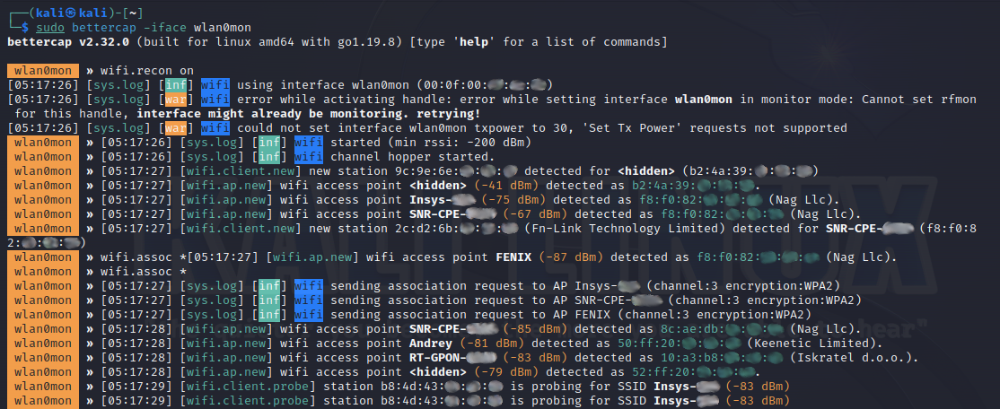</td>
    <td>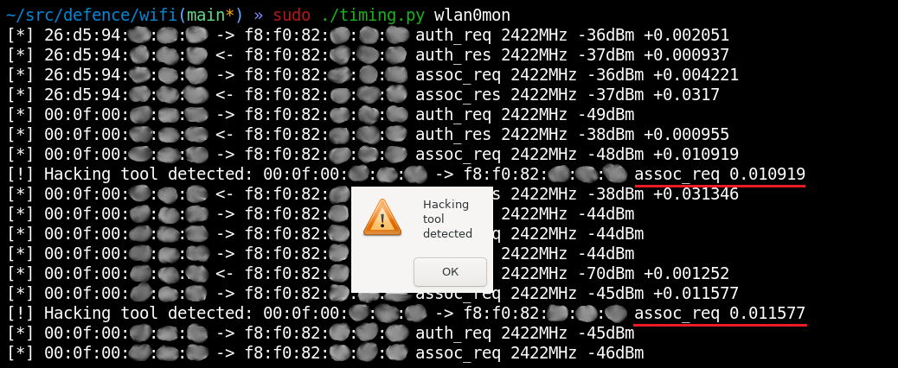</td>
 </tr>
</table>

Детект запуска хакерской утилиты `hcxdumptool`, выполняющей подключение к точкам доступа вокруг:

<table border="0">
 <tr>
    <td></td>
    <td>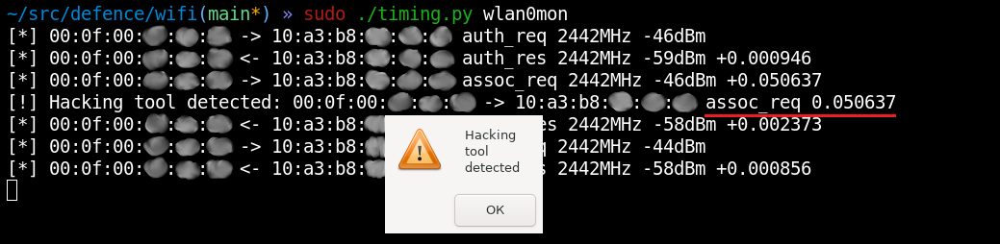</td>
 </tr>
</table>

Детект запуска хакерской утилиты `reaver`, выполняющей подключение к точке доступа:

<table border="0">
 <tr>
    <td>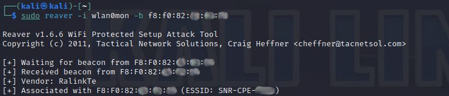</td>
    <td>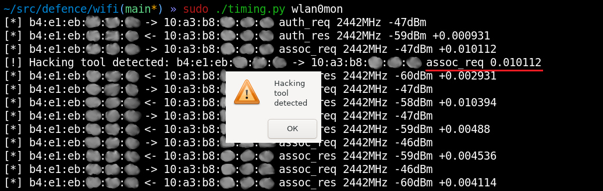</td>
 </tr>
</table>

В каждом случае хакерское ПО имеет характерную временную задержку при генерации ответных радиопакетов точке доступа.


Приёмы противодействия (Wireless IPS).

### wifi/prevention/m2.py

Одним из вариантов предотвращения атаки захвата `handshake` может быть отправка в радиоэфир ложных handshake. Что бы хакерское ПО срегировало нужно отправить в радиоэфир три пакета: `beacon`, `EAPOL M1` и `EAPOL M2`. Скрипт `m2.py` умеет это делать - он генерит handshake на основе произвольной парольной фразы и помещает его в EAPOL M2 пакете. Скрипт m2.py автоматически вызывается скриптом `deauth.py`, который умеет обнаруживать эту атаку. Вместе они дают решение для автоматического реагирования на атаку деаутентификации и захвата WPA handshake:

<table border="0">
 <tr>
    <td>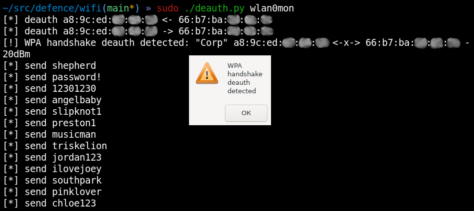</td>
    <td>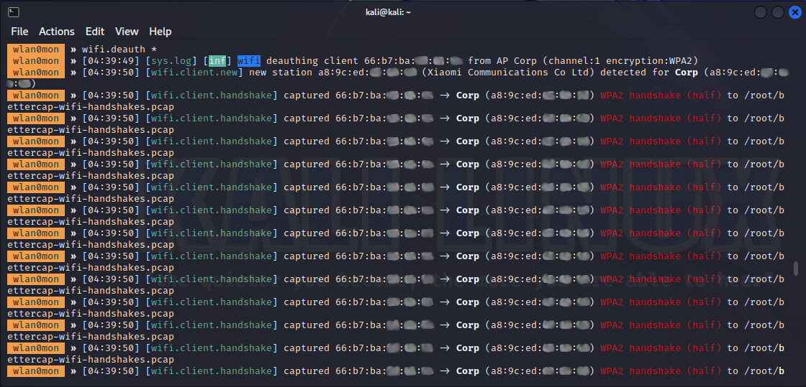</td>
 </tr>
</table>

Захват хакером ложных handshake даёт надежду быть перезаписанным или затеряться легитимному handshake среди ложных:


В любом случае, вынуждение хакера производить брутфорс ложных handshake это снижение общей его производительности и, следовательно, снижение шансов на успешность его атаки.

### wifi/prevention/m1.py

Для предотвращения захвата `PMKID`-хэшей можно отправлять в эфир аналогичные фейковые хэши. Скрипт `m1.py` умеет генерировать PMKID по произвольной парольной фразе и помещает его в `EAPOL M1` пакет. В свою очередь скрипт m1.py автоматически вызывается скриптом `pmkid.py`, который умеет обнаруживать эту атаку:

<table border="0">
 <tr>
    <td>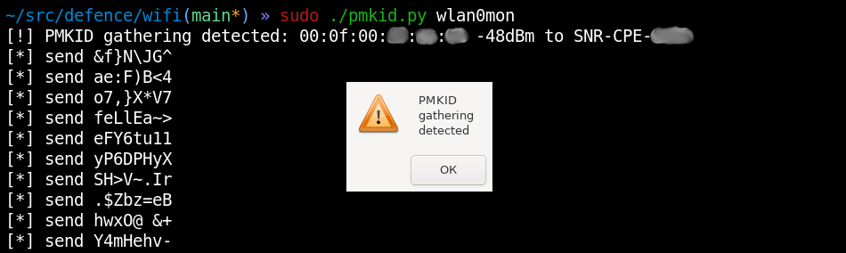</td>
    <td>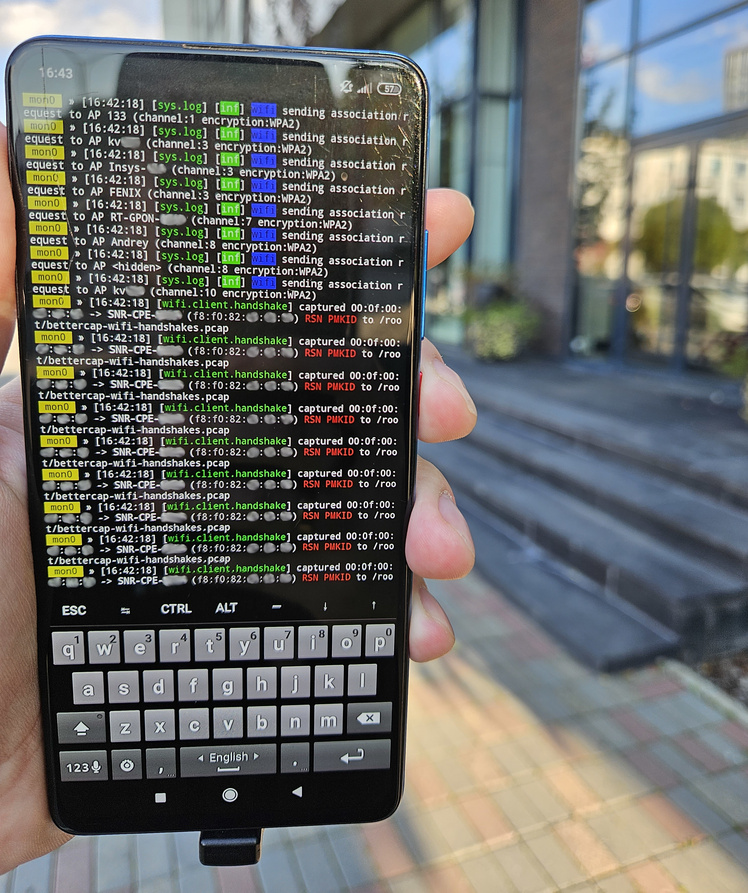</td>
 </tr>
</table>

Захват ложных PMKID вынуждает хакера впустую тратить время и вычислительные мощности на брутфорс несуществующих хэшей:

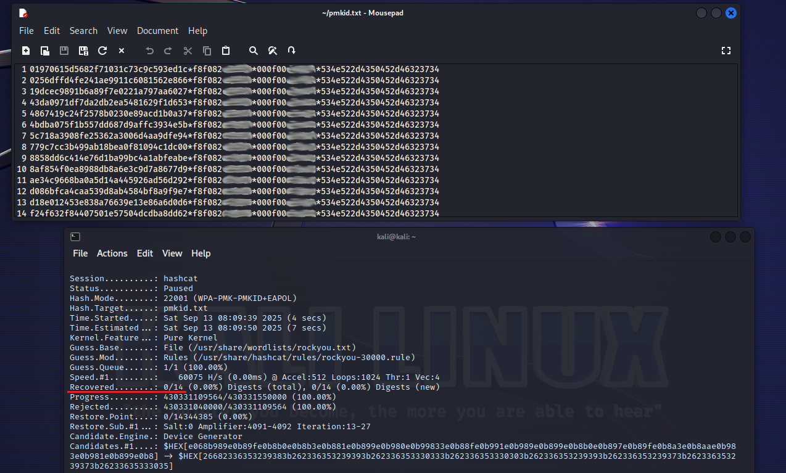

### wifi/prevention/gtc.sh

Если хакер использует вредоносную точку доступа WPA Enterprise для получения логинов и паролей корпоративных пользователей, то действенным противодействием является отправка на такую точку доступа случайных пар логинов и паролей. Скрипт `gtc.sh` умеет генерировать случайные учетные данные и отправляет их в виде `netntlm1`-хэша. Он автоматически вызывается скриптом `eap.py` когда тот обнаруживает эту атаку:

<table border="0">
 <tr>
    <td>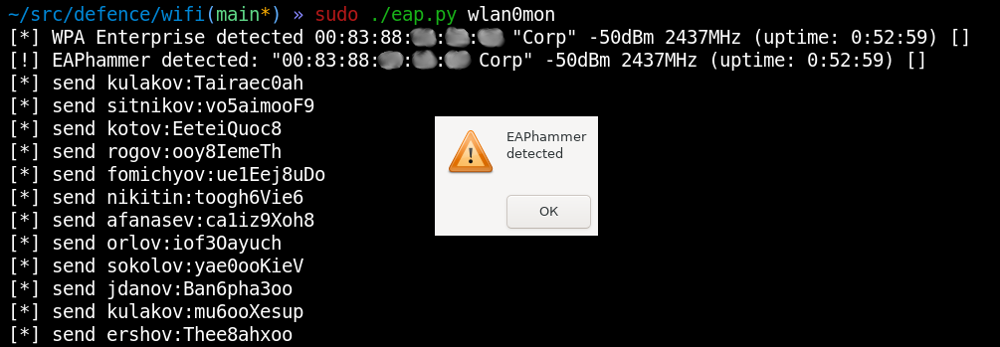</td>
    <td>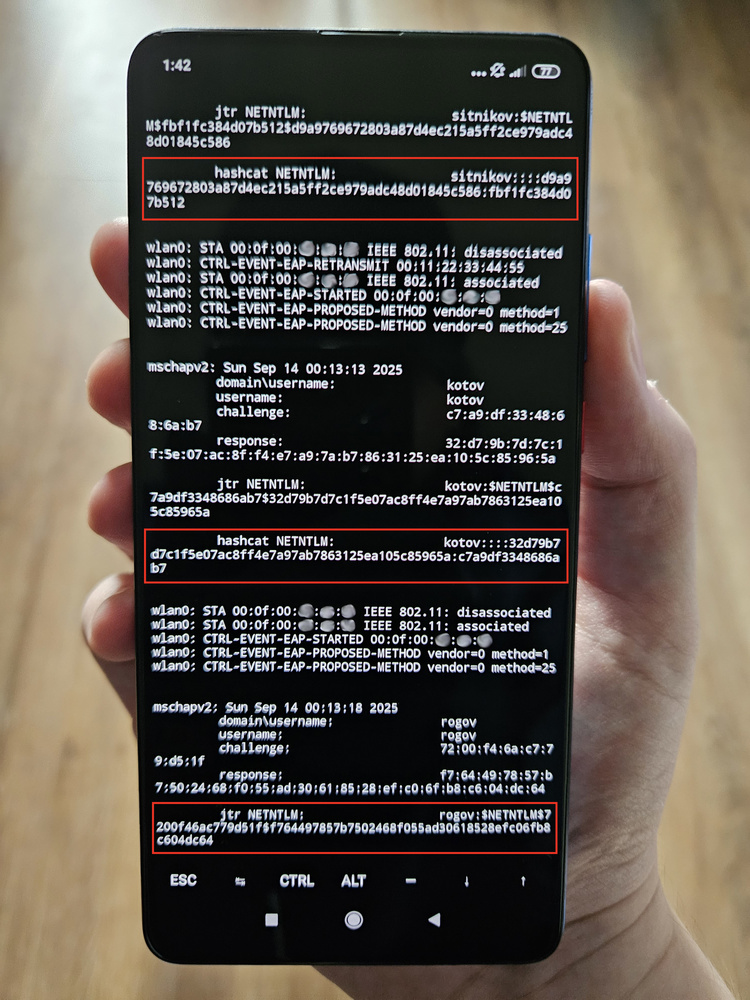</td>
 </tr>
</table>

Хакер не будет иметь возможности отличить принятые фейковые учетные данные от реальных и будет вынужден тратить ресурсы не брутфорс каждого захваченного хэша.

### wifi/prevention/deauth.py

Скрипты `bruteforce.py` (детект атак онлайн брутфорса точек доступа) и `wps.py` (детект WPS атак на точки доступа) при обнаружении вредоносной активности хакера на точку доступа автоматически вызывают скрипт `deauth.py`, выполняющий `точечную` деаутентификацию:

<table border="0">
 <tr>
    <td>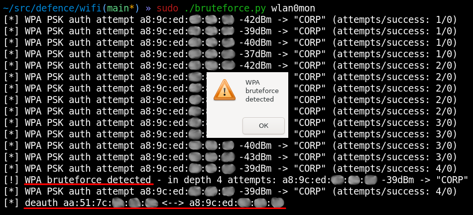</td>
    <td>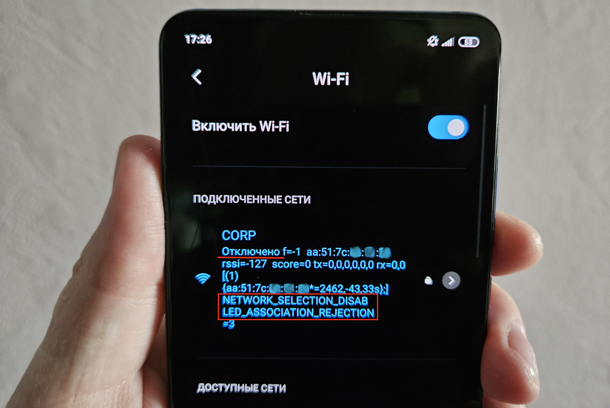</td>
 </tr>
</table>

<table border="0">
 <tr>
   <td>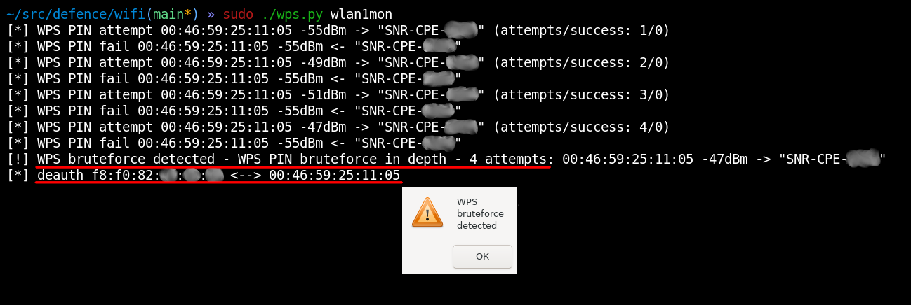</td>
   <td>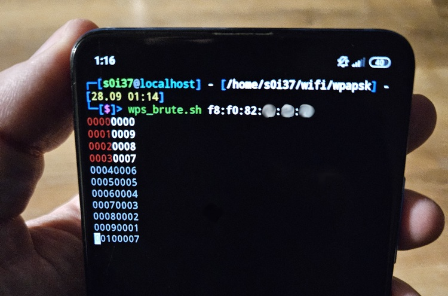</td>
 </tr>
</table>

Скрипты `eviltwin.py` (обнаружение фишинговых точек доступа) и `karma.py` (обнаружение всего семейства RogueAP-атак) для предотвращения подключения потенциальных жертв к вредоносной точке доступа автоматически вызывают скрипт `deauth.py`, выполняющий `широковещательную` деаутентификацию:

<table border="0">
 <tr>
    <td>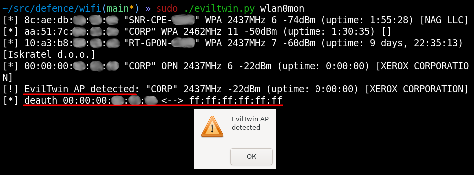</td>
    <td>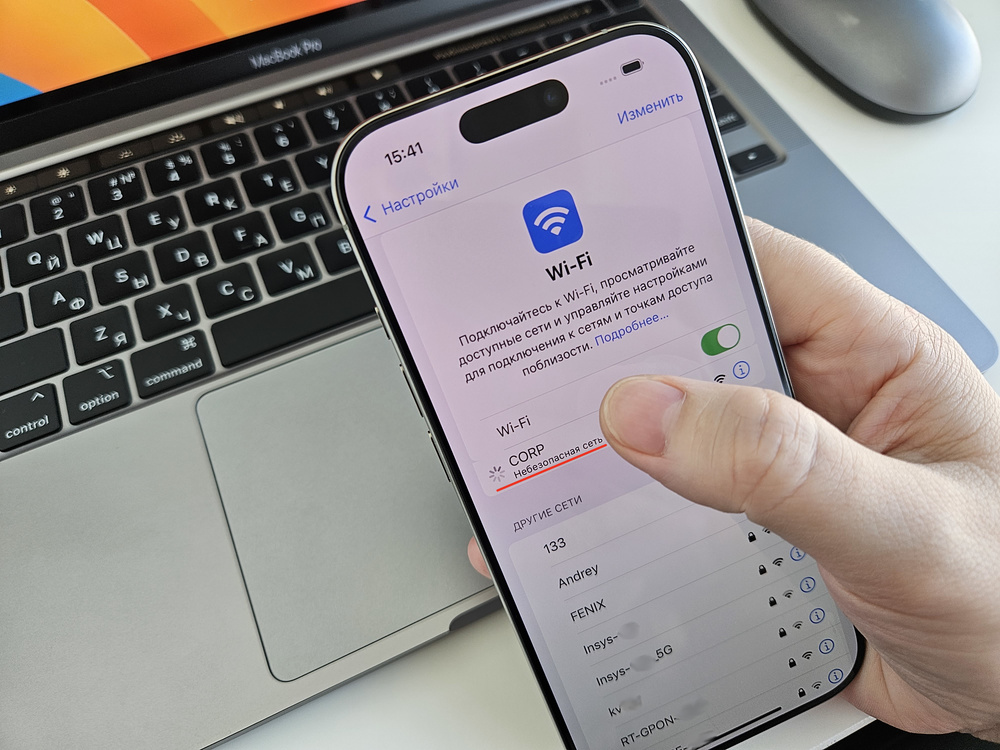</td>
 </tr>
</table>

<table border="0">
 <tr>
    <td>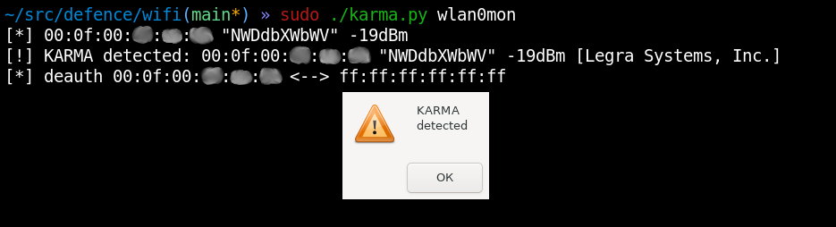</td>
    <td>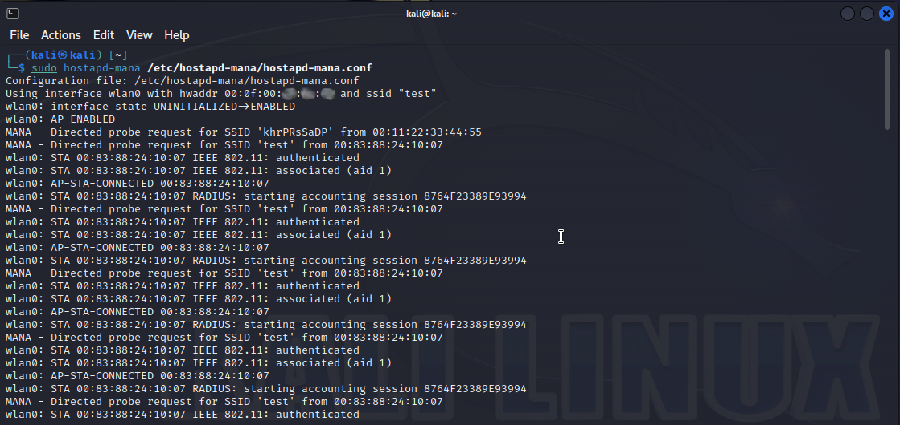</td>
 </tr>
</table>

## Уровень сети \[внутренний нарушитель\]

Злоумышленник только что проник в вашу корпоративную сеть. У него еще нет корпоративной учетной записи, и он почти ничего не знает о вашей сети. Его действия могут быть во многом случайными, а значит достаточно шумными. Очень важно поймать злоумышленника на этой ранней стадии.

### sniffer.py

Запущенный сниффер еще не является сетевой атакой, но его обнаружение является важной предпосылкой для возможных будущих атак. Порядочный пользователь не будет запускать сниффер.
Неосторожно запущенный сниффер будет делать предсказуемые для нас DNS-запросы, поскольку сниффер может показывать вместо IP-адреса доменное имя. Если мы периодически отправляем пакет от имени IP-адреса, имеющего DNS-запись PTR, а затем проверяем наличие этой записи в кеше корпоративного DNS-сервера (нерекурсивный запрос, он же DNS-кеш snooping), то мы, скорее всего, обнаружим злоумышленника:

<table border="0">
 <tr>
    <td></td>
    <td></td>
 </tr>
</table>

### tcp.py

Второе, чем скорее всего воспользуется внутренний злоумышленник в самом начале, это, конечно же, сканирование портов. Пока у него нет доменной учетной записи и он не знает структуру сети, он будет вслепую искать свои цели, сканируя порты. И рано или поздно его пакеты дойдут до вашего компьютера.
Заметить такую активность довольно легко. Из всего трафика необходимо выделить только пакеты TCP-SYN, что является отличным маркером этой сетевой атаки. Скрипт `tcp.py` реагирует только на входящие соединения; если количество уникальных портов превышено, выдается предупреждение.
В результате, даже если злоумышленник просканировал всего пару портов, мы это увидим:

<table border="0">
 <tr>
    <td></td>
    <td></td>
 </tr>
</table>

### mitm.py

Прослушав достаточное количество трафика и просканировав свои цели, злоумышленник наконец может перейти к активным действиям и начать перехват трафика. Неважно, как он это сделает, важно то, к чему все это приведет. Если злоумышленник начнет пропускать через себя чужой трафик, это приведет к уменьшению в нем `IP.ttl`.
Этот скрипт периодически проверяет каждый узел в списке. И как только где-то меняется длина маршрута (IP.ttl), он выдаёт трассировку моментально вычисляя хакера.
Первое, за чем вам нужно следить таким образом, — это, конечно же, ваш шлюз. Однако этот метод обнаружения позволяет увидеть последствия перехвата трафика за пределами собственной подсети – по всей локальной сети, ведь далеко не факт, что злоумышленник окажется в той же подсети, что и вы. Таким образом, список мониторинга можно расширить, включив в него критически важные серверы — ваш DC, Exchange, SCCM, WSUS, виртуализацию и т. д. Более того, вы можете отслеживать шлюз каждой VLAN и даже каждой рабочей станции.

<table border="0">
 <tr>
    <td></td>
    <td></td>
 </tr>
</table>

При некоторых обстоятельствах злоумышленник может стоять не посередине, а вместо какого-либо сетевого устройства.
Поэтому эффективнее проверять перехват трафика не по длине маршрута, а по самому маршруту — с помощью трассировки. Этот метод также позволит увидеть особо хитрых злоумышленников, которые перед перехватом трафика произвели фиксацию TTL.
Однако процедура трассировки несколько длиннее, поэтому этот метод обнаружения по умолчанию закомментирован в скрипте.

### dhcp.py

В локальных сетях, помимо полноценных MiTM-атак, могут осуществляться и «частичные» атаки по перехвату трафика. Одним из примеров может быть DHCP, позволяющий вам указать себя в качестве шлюза или DNS-сервера. Контролируя DNS-запросы, злоумышленник может выборочно перенаправлять соединения, тем самым реализуя частичный MiTM.
Если IPv6 не используется в локальной сети, но не отключен на узлах сети, то злоумышленник может добиться аналогичного эффекта с помощью DHCPv6, поскольку все современные операционные системы предпочитают IPv6 IPv4.
Обе атаки могут быть обнаружены с помощью одиночных запросов Discover. Скрипт периодически отправляет такие широковещательные запросы на DHCP и DHCPv6. И если кто-то еще, помимо легитимного узла, начинает отвечать, происходит обнаружение:

<table border="0">
 <tr>
    <td></td>
    <td></td>
 </tr>
</table>

<table border="0">
 <tr>
    <td></td>
    <td></td>
 </tr>
</table>

Замечание: атака и обнаружение работает только на текущий сегмент сети.

### netbios.py

В локальных сетях гораздо более популярным примером частичного перехвата трафика является `responder`. Отвечая ложными ответами на широковещательные запросы разрешения имен (например, через NetBIOS), хакер может обманом заставить вашу рабочую станцию подключиться куда угодно, даже к себе. В результате это приводит к ошибочным соединениям, обычно с автоматической сквозной аутентификацией. В свою очередь, это предоставляет учетные данные, которые могут быть подвергнуты атакам методом перебора или могут использоваться для обхода аутентификации с помощью атак ретрансляции NTLM.
Обнаружить responder легко. Вам просто нужно сгенерировать случайное короткое имя и спросить о нем широковещательно. Эту проверку выполняет скрипт `netbios.py`. Он периодически передает в сеть запросы NetBIOS со случайными именами. И как только начнут поступать ответы – тревога.

<table border="0">
 <tr>
    <td></td>
    <td></td>
 </tr>
</table>

Замечение: атака и обнаружение работает только на текущий сегмент сети.

### relay.py

Атаки перенаправления аутентификации NTLM сегодня образуют почти половину атак в локальных сетях с Windows узлами. В случае если мы имеем возможность слушать сетевой трафик других узлов, то можно выявлять NTLM-relay атаки на них. Скрипт `relay.py` отслеживает в каждой NTLM-аутентификации значение `Challenge`, которое всегда должно быть уникальным. Наличие одинакового challenge у двух разных NTLM-аутентификаций возможно только при атаке перенаправления аутентификации.

Обнаружение атаки NTLM-relay c `SMB` на `SMB` (lnk-file):

<table border="0">
 <tr>
    <td>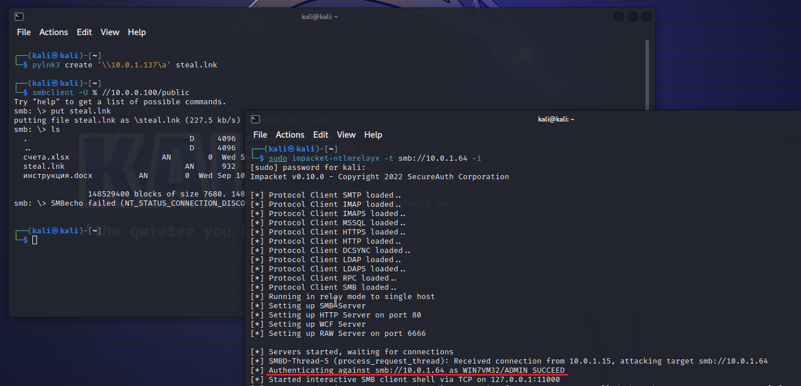</td>
    <td>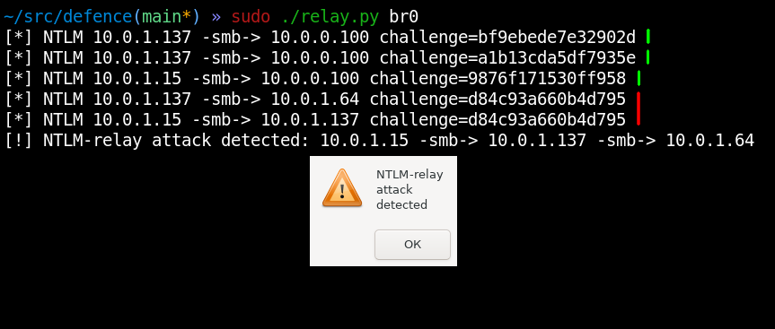</td>
 </tr>
</table>

Обнаружение атаки NTLM-relay с `HTTP` на `LDAP` (NetBIOS spoofing):

<table border="0">
 <tr>
    <td>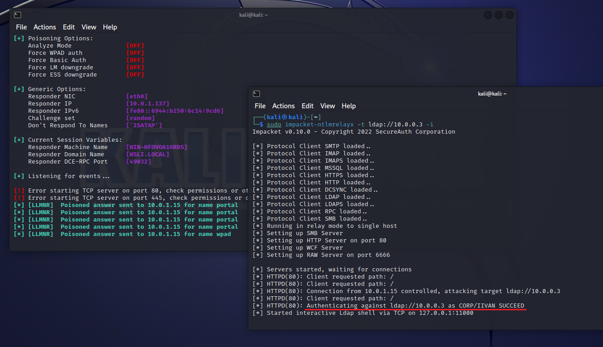</td>
    <td>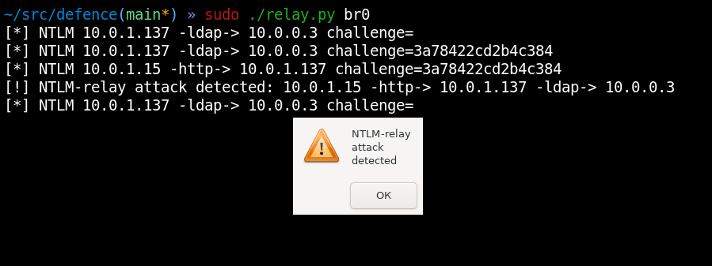</td>
 </tr>
</table>

Обнаружение атаки NTLM-relay с `SMB` на `HTTP` (anonymous coerce + ADCS ESC8):

<table border="0">
 <tr>
    <td>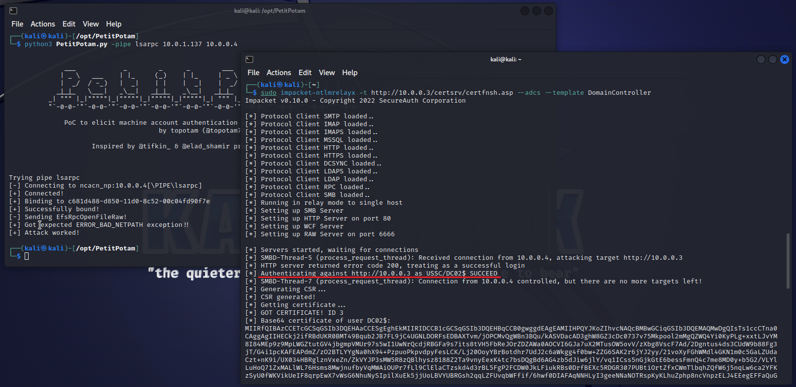</td>
    <td>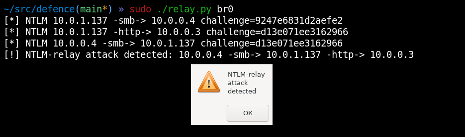</td>
 </tr>
</table>

### honeypot/smb/ms17-010.sh

Оказавшись во внутренней сети, продвинутые злоумышленники ищут так называемые «низковисящие фрукты» — уязвимости, которые часто встречаются, легко эксплуатируются и оказывают наибольшее воздействие. И, пожалуй, чемпионом здесь является МS17-010. Средства проверки этой уязвимости есть повсюду: в сканерах типа `nessus`, эксплойт-паках типа `metasploit` и, конечно, всеми любимом `nmap`.
Во всех случаях проверка уязвимостей происходит схожим образом — вызовом SMB-транзакции TRANS_PEEK_NMPIPE (0x23) с параметром MaxParameterCount = 0xffff, ответом на которую должен быть STATUS_INSUFF_SERVER_RESOURCES (0xC0000205).
Чтобы сделать вид, что мы уязвимы для MS17-010, мы можем использовать в качестве основы хакерский инструмент `smbserver.py`. В результате наш компьютер будет выглядеть уязвимым для всех чекеров:

<table border="0">
 <tr>
    <td></td>
    <td></td>
 </tr>
</table>


Только представьте радость хакера, обнаружившего уязвимую машину. А вы навели его на неверный след и поймали в ловушку.
Такая ловушка `ms17-010.sh` будет более заметна в сетях с высоким уровнем безопасности, ведь даже один-единственный MS17-010 для злоумышленника будет как костёр посреди поля ночью.

### honeypot/ssh/auth.py

В локальной сети также могут быть атакованы серверы Linux. Самая распространенная, простая и эффективная атака против них — подбор пароля по ssh. В отличие от всех других потенциально уязвимых сервисов, openssh присутствует практически на каждом сервере. Такие низковисящие фрукты могут последовать как на самых первых шагах после проникновения — сразу после сканирования портов, так и позже — во время атаки с повторным использованием пароля.
Все, что вам нужно, чтобы заметить злоумышленника, — это просто запустить где-нибудь SSH-сервер, который показывает попытки аутентификации.
По результатам сканирования портов он обязательно будет включен в список целей брутфорса и сразу заметит эту атаку.

<table border="0">
 <tr>
    <td></td>
    <td></td>
 </tr>
</table>

И по выбранным нами паролям можно быстро понять, что использовался тот или иной словарь.


## Уровень Active Directory \[внутренний нарушитель\]

Если злоумышленник незамеченным переместился на уровень Active Directory, то мы проиграли первый раунд. Теперь ему предстоит столкнуться с дюжиной других реальных атак с целью повышения привилегий, некоторые из которых совершенно бесшумны. Но шанс увидеть некоторые характерные особенности у нас все же есть, просто важно знать, на что обращать внимание.
Есть пара трюков, позволяющих увидеть атаки в среде Active Directory, и их может выполнить любой пользователь домена.

### ad/auth.py

Абсолютно любой пользователь домена может запросить через LDAP список объектов, у которых изменились специальные атрибуты — временные метки. Отслеживая изменения атрибута `lastLogon`, вы можете увидеть динамику успешных аутентификаций, атрибута `badPasswordTime` — ложных аутентификаций, а `lockoutTime` — динамику блокировок. И все это означает, что любой пользователь домена может видеть активность всех пользователей и, следовательно, видеть атаки на пароли в масштабе всего домена.

<table border="0">
 <tr>
    <td></td>
    <td></td>
 </tr>
</table>

Прямой перебор учетных записей домена встречается очень редко и, скорее всего, является результатом неосторожных атак. Если мы видим явно словарные пароли, то это, скорее всего, отголоски атаки на ваш внешний сетевой периметр (администратор, guest, testuser, test1). А вот если это уникальные для вашей компании имена пользователей (joe.smith, jane.smith), которые можно было узнать только находясь внутри, то это уже маркер внутреннего нарушителя.

Атака с распылением паролей более реалистична, поскольку при правильном использовании она не приводит к блокировке. Зато нам будет прекрасно видно:

<table border="0">
 <tr>
    <td></td>
    <td></td>
 </tr>
</table>

Используя небольшой аналитический скрипт `auth-anal.py` и встроенные математические возможности Python, мы можем построить простую аналитику. И допустим, по всплеску блокировок в ночное время можно сделать вывод, что пароли кто-то подбирал:


Отличным признаком того, что кто-то пытается взломать ваши учетные записи, является блокировка «Администратора» или «wrong password» пользователя «Гость». Также вы можете отслеживать никем не используемый аккаунт, любое событие аутентификации для которого можно считать аномалией. И именно по этим событиям скрипт `auth.py` выполняет настроенное уведомление - `email`, `sms`, `telegram`.

### ad/deception.py

Любой пользователь обладающий доменной учетной записью может сделать простую deception-ловушку, которая будут ничуть не менее эффективна чем у профессиональных deception систем. Важно лишь поставить ловушку в удачном месте.
Мало какой хакер пройдёт мимо сетевых дисков. В любой компании можно найти несколько сетевых дисков с правом записи, куда можно положить файл с привлекательным названием "пароль.docx" и поместить в него логин и произвольный пароль. Когда хакер обнаружит этот файл он непременно опробует эту находку, что стригерит событие ложной аутентификации, которое можно увидеть в Active Directory по изменению атрибута `badPasswordTime`. Нужно лишь найти пользователя, которым ни кто не пользуется, это можно сделать следующим LDAP-запросом:

```
(&(objectCategory=person)(objectClass=user)(!(userAccountControl:1.2.840.113556.1.4.803:=2))(&(lastLogon<=132538500000000000)(badPasswordTime<=132538500000000000)))
```

Где значение метки времени можно посчитать следующим образом:

```
echo $[(`date +"%s" -d '2020-12-31 06:00:00'` + 11644473600) * 10000000]
(&(objectCategory=person)(objectClass=user)(lastLogon>=133124328000000000))
```

Теперь когда хакер клюнет на этот ложный слой данных, мы тут же обнаружим это по событию аутентификации на ни кем не используемой учетной записи:

<table border="0">
 <tr>
    <td>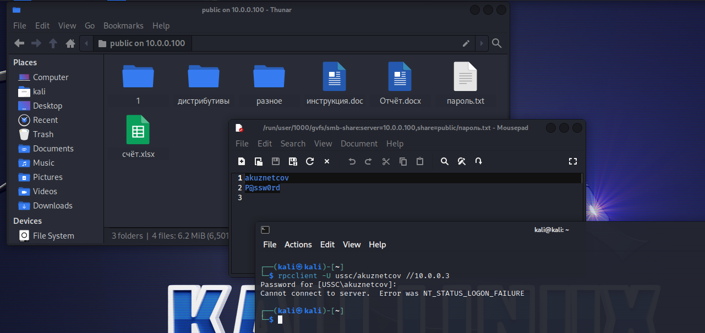</td>
    <td>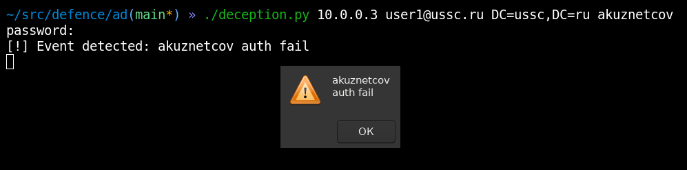</td>
 </tr>
</table>

### ad/changes.py

В Active Directory бывает огромное количество атак. И большинство объединяет то, что каждый из них оставляет следы в виде соответствующих атрибутов. Отслеживая эти атрибуты через LDAP в режиме реального времени, мы могли заметить любую атаку почти в ту же секунду, даже если злоумышленник находится на другом конце локальной сети.
Это вполне возможно, и все, что вам нужно, это быть простым пользователем домена.
Практически любое изменение чего-либо в объекте AD, включая модификацию ACL, приводит к изменению атрибута `whenChanged`, с помощью которого мы и можем запрашивать измененные объекты в цикле.

По мере развития атак в инфраструктуре Active Directory часто обнаруживаются различные неправильные настройки прав доступа, а также relay-атаки, позволяющие выполнять действия от имени другой учетной записи. В конечном итоге это позволяет злоумышленникам совершать множество опасных действий.
Примером аккуратной и бесшумной атаки на объект `user` является добавление к нему атрибута `servicePrincipalName` и использование атаки `TargetedKerberoasting` для получения хэша пароля пользователя - и мы видим эту атаку в момент создания и удаления SPN:

<table border="0">
 <tr>
    <td></td>
    <td></td>
 </tr>
</table>

Если у злоумышленника есть права на запись в объект учетной записи компьютера, он может использовать технику `RBCD` или `ShadowCredentials`, чтобы перехватить доступ к ПК жертвы. Это видно по появлению специфического атрибута `msDS-AllowedToActOnBehalfOfOtherIdentity`/`msDs-KeyCredentialLink`:

<table border="0">
 <tr>
    <td></td>
    <td></td>
 </tr>
</table>

Наконец, следует также обратить внимание на объекты групповой политики. Компрометация этого объекта может иметь катастрофические последствия, если под группу попадет много компьютеров. Самая ценная вещь в групповой политике — это атрибут `gPCFileSysPath`, который указывает на папку, в которой может храниться исполняемый скрипт или куст реестра. Попытку перенаправления можно обнаружить по соответствующему атрибуту:

<table border="0">
 <tr>
    <td></td>
    <td></td>
 </tr>
</table>

Если злоумышленник получил доступ к определенной интересующей его группе, то главное, что он может сделать, это, конечно же, добавить учетную запись в эту группу. Добавление объекта в группу происходит через атрибут `member`, который мы увидим в ту же секунду:

<table border="0">
 <tr>
    <td></td>
    <td></td>
 </tr>
</table>

Атаки ACL, возможно, представляют собой еще более скрытую угрозу. Практически все, что было показано выше, может быть следствием развития неправильных настроек прав доступа (`ACL`). Хорошо выявляемые с помощью `Bloodhound`, они зачастую представляют собой надежные, невидимые пути, ведущие простого пользователя домена «в дамки» – к администратору домена. Но настолько ли незаметны модификации ACL? На самом деле даже малейшее изменение прав приводит к неявному изменению атрибута whenChanged, а значит, наш метод будет работать и здесь.
Если у хакера есть соответствующие права (`GENERIC_ALL`, `WRITE_OWNER`), он может сменить владельца объекта. Как только это происходит, у объекта меняется атрибут `nTSecurityDescriptor`, в котором хранится вся информация о правах на этот объект. Несмотря на то, что информация в нем представлена в двоичном виде, скрипт `changes.py` может разобрать его структуру до канонической формы. И в этом примере мы сразу видим, что произошло:

<table border="0">
 <tr>
    <td></td>
    <td></td>
 </tr>
</table>

Но на этом атака редко прекращается и, скорее всего, должно произойти что-то еще. Давайте посмотрим дальше.
Если внутренний злоумышленник обнаружит, что у него есть права на какой-то объект, которые позволяют ему изменять разрешения, он может назначить туда произвольное право. Чаще всего это просто полные права на объект (GENERIC_ALL). Этот случай показывает, как хакер добавляет `ACE` с маской GENERIC_ALL (полный доступ). Что мы видим:

<table border="0">
 <tr>
    <td></td>
    <td></td>
 </tr>
</table>

В реальных инфраструктурах путь от пользователя к администратору домена может быть очень тернистым, и я бы рекомендовал обратить внимание на изменение ACL любого объекта, где встречаются `GENERIC_ALL` и `WRITE_DACL`, поскольку каждый из них оказывает самое сильное влияние в своей ситуации.

Скрипт `changes.py`, состоящий всего из 100+ строк кода, способен под любой даже непривилегированной учетной записью домена видеть в реальном времени, какие объекты были созданы, удалены или изменены. Показать, какие именно атрибуты в них изменились, в том числе преобразовать ACL к каноническому, удобочитаемому виду.
Всего один скрипт может стать практически универсальным инструментом мониторинга Active Directory.


## Постэксплуатация

Наконец, что делать, если хакер достиг своей цели и сумел проникнуть в систему? Тогда сделаем хоть что то, что бы усложнить ему жизнь.
Если хакер проникнет на ваш компьютер, то, скорее всего, его будет интересовать только ваш пароль. И вы, как пользователь, вправе придумать любой пароль, даже если он содержит подстановочные знаки и использование опасных команд. Таким образом, в ваших силах сделать `RCE` на хакерской машине.

<table border="0">
 <tr>
    <td></td>
    <td></td>
 </tr>
</table>


По данным опроса, проведенного среди хакеров, пентестеров и ИТ-специалистов, 21% неправильно ввели пароль в командной строке, уничтожив свою `Kali` во время атаки повторного использования пароля. Простая рекомендация смогла бы остановить 1 хакера из 5.
Нет никакой гарантии, сработает это или нет, но это точно не сделает ваш пароль слабее =)
